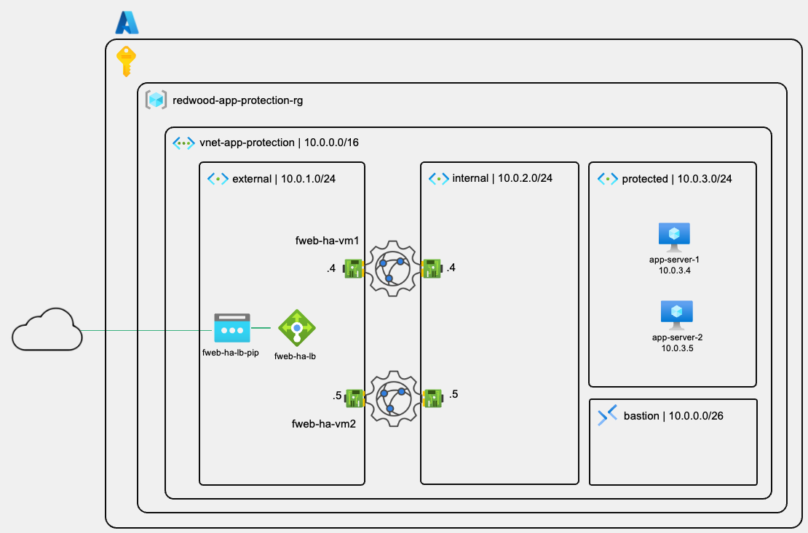

# AZ-301: FortiWeb Application Protection on Azure

## Fortinet Security Hands On Workshop | Azure Series

### Welcome

Building on the foundational skills from AZ-101, AZ-102, and AZ-201, this workshop addresses one of the most critical challenges organizations face when deploying customer-facing applications on Azure: **web application protection**. While previous workshops focused on network-level security with FortiGate and infrastructure automation with Terraform and Ansible, AZ-301 shifts focus to the application layer — where the majority of modern attacks occur.

Redwood Industries is launching their first customer-facing web application on Azure. Their security team has mandated WAF protection before go-live, and their SLA requires 99.9% availability — ruling out a single-appliance deployment. In this workshop, participants will deploy a FortiWeb Active-Active cluster using an Azure ARM template, configure configuration replication between nodes, deploy and connect application servers, and progressively enable WAF protection — culminating in a live attack
simulation that demonstrates FortiWeb blocking OWASP Top 10 threats in real time.

At the core of this solution is FortiWeb's reverse proxy architecture combined with Azure's External Load Balancer, providing active-active WAF inspection, automatic failover, and centralized attack logging — all without exposing application servers directly to the internet.

---

### Time Requirements

The estimated time to complete this workshop is **3 hours**.

| Lab | Duration | Topic |
| --- | --- | --- |
| Lab 1 | 45 min | Infrastructure Setup and FortiWeb HA Deployment |
| Lab 2 | 30 min | Application Server Deployment |
| Lab 3 | 40 min | FortiWeb Traffic Steering |
| Lab 4 | 35 min | WAF Protection and Attack Simulation |

---

### Target Audience

- Cloud security architects designing application protection solutions
- Network security engineers implementing WAF in Azure environments
- Fortinet presales engineers and consultants
- IT professionals responsible for enterprise Azure application security
- Partners expanding their FortiWeb Azure practice
- Security operations teams managing web application protection

**Experience Level:** Intermediate to Advanced professionals with AZ-101/AZ-102/AZ-201 completion or equivalent hands-on Azure networking experience.

---

### Prerequisites

- Completed AZ-101, AZ-102 and AZ-201 (or equivalent Azure networking experience)
- Azure subscription with Contributor access
- 2 FortiFlex tokens (one per FortiWeb node) — provided by your instructor
- Basic familiarity with Azure Portal navigation
- Understanding of web application concepts (HTTP, reverse proxy, WAF)

---

### What You'll Learn

- **FortiWeb Active-Active Architecture:** How both nodes handle traffic simultaneously, how the Azure External Load Balancer distributes sessions, and how this differs from the Active-Passive FortiGate HA covered in AZ-102
- **ARM Template Deployment:** Deploy a complete muti-resource FortiWeb HA cluster in minutes using Fortinet's reference architecture template with FortiFlex licensing injected via `customData`
- **Configuration Replication:** Configure FortiWeb's Server/Client Manager model to keep both nodes identical — and establish the replication workflow used throughout the workshop
- **Azure Bastion for Zero-Exposure Management:** Deploy application servers with no public IPs and access them securely through browser-based SSH
- **FortiWeb Traffic Model:** Understand the three-object model — Server Pool, Virtual Server, and Server Policy — and how they work together to define traffic flow through the reverse proxy
- **WAF Protection Profiles:** Explore FortiWeb's built-in Inline Standard Protection profile, understand what it covers, and apply it to a live traffic policy
- **Attack Simulation and Log Analysis:** Replay SQL Injection, XSS, Path Traversal, and Command Injection attacks against an unprotected baseline, then enable WAF protection and confirm each attack is blocked and logged

---

### Reference Architecture

After completing this workshop, you will have deployed the following architecture:

#### Key Components

| Component | Resource | Purpose |
| --- | --- | --- |
| FortiWeb Node 1 | `fweb-ha-vm1` | Active WAF — Config Server |
| FortiWeb Node 2 | `fweb-ha-vm2` | Active WAF — Config Client |
| External Load Balancer | `fweb-ha-lb` | Distributes inbound traffic across both FortiWeb nodes |
| Application Server 1 | `app-server-1` | Protected web application backend |
| Application Server 2 | `app-server-2` | Protected web application backend |
| Azure Bastion | `bas-app-protection` | Secure management access — no public IPs on app servers |
| NAT Gateway | `nat-app-protection` | Outbound internet access for protected subnet |

---

### Laboratories

This workshop is organized in four sequential laboratories, each building on the
previous.

**Lab 1** — [Infrastructure Setup and FortiWeb HA Deployment](/az-301-lab1/README.md)  
**Lab 2** — [Application Server Deployment](/az-301-lab2/README.md)  
**Lab 3** — [FortiWeb Traffic Steering](/az-301-lab3/README.md)  
**Lab 4** — [WAF Protection and Attack Simulation](/az-301-lab4/README.md)

---

> [!NOTE]
> This workshop provides examples and configuration steps as instructional content. These examples help you understand FortiWeb HA deployment and web application protection on Azure. **Please note that these examples are not suitable for use in production environments without proper testing, security hardening, and customisation for your specific requirements.**

---

> [!CAUTION]
> This workshop deploys several Azure resources including two FortiWeb VMs, two application servers, a load balancer, Azure Bastion, and a NAT Gateway. **Expected cost: $5–10 CAD for the 3-hour workshop if resources are deleted immediately after.** At the end of the workshop, delete `redwood-app-protection-rg` to remove all resources in a single operation and avoid ongoing charges.

---

> [!WARNING]
> This workshop uses FortiFlex tokens for BYOL licensing. Tokens are injected into the FortiWeb VMs via `customData` at deployment time and activate automatically on first boot. **Tokens are single-use — if deployment fails partway through, the token may be consumed.** Contact your instructor if you need replacement tokens before redeploying.

---

### Additional Resources

**Fortinet Documentation:**

- FortiWeb Azure Deployment Guide: <https://docs.fortinet.com/document/fortiweb-public-cloud/latest/deploying-fortiweb-on-azure/640214/system-requirements>
- FortiWeb Administration Guide: <https://docs.fortinet.com/document/fortiweb/8.0.4/administration-guide/60895/introduction>
- FortiWeb HA Configuration: <https://docs.fortinet.com/document/fortiweb-public-cloud/latest/use-case-high-availability-for-fortiweb-on-azure/277766/overview>
- FortiFlex Documentation: <https://docs.fortinet.com/product/flex-vm/26.1>

**Azure Documentation:**

- Azure Load Balancer: <https://learn.microsoft.com/azure/load-balancer/>
- Azure Bastion: <https://learn.microsoft.com/azure/bastion/>
- Azure NAT Gateway: <https://learn.microsoft.com/azure/nat-gateway/>
- ARM Template Specs: <https://learn.microsoft.com/azure/azure-resource-manager/templates/template-specs>

**Workshop GitHub Repository:**

- ARM Template: <https://github.com/regisftm/AZ-301/tree/main/arm-template>
- Demo Application: <https://github.com/regisftm/ubuntu-website>

---

*Workshop Version 1.0 — April 2026*
