# Lab 1: Infrastructure Setup and FortiWeb HA Deployment

## Lab Overview

**Duration:** 45 minutes  
**Difficulty:** Intermediate  
**Prerequisites:** Completed AZ-201 or equivalent Azure networking experience, FortiFlex tokens available, Azure service principal credentials ready

### Objective

Deploy the foundational infrastructure for Redwood Industries' web application protection environment. You will create a dedicated resource group and virtual network, configure Azure Bastion for secure management access, and deploy a FortiWeb Active-Active HA cluster using an Azure ARM template into the existing network.

### What You'll Build

By the end of this lab, you will have:

- ✅ A dedicated resource group for all web protection resources
- ✅ A hub virtual network with four subnets (Bastion, External, Internal, Protected)
- ✅ Azure Bastion for secure, browser-based access to private VMs
- ✅ FortiWeb Active-Active HA cluster deployed via ARM template
- ✅ External Load Balancer distributing traffic across both FortiWeb nodes
- ✅ Initial access to the FortiWeb management interface verified

### Architecture

After Lab 1:

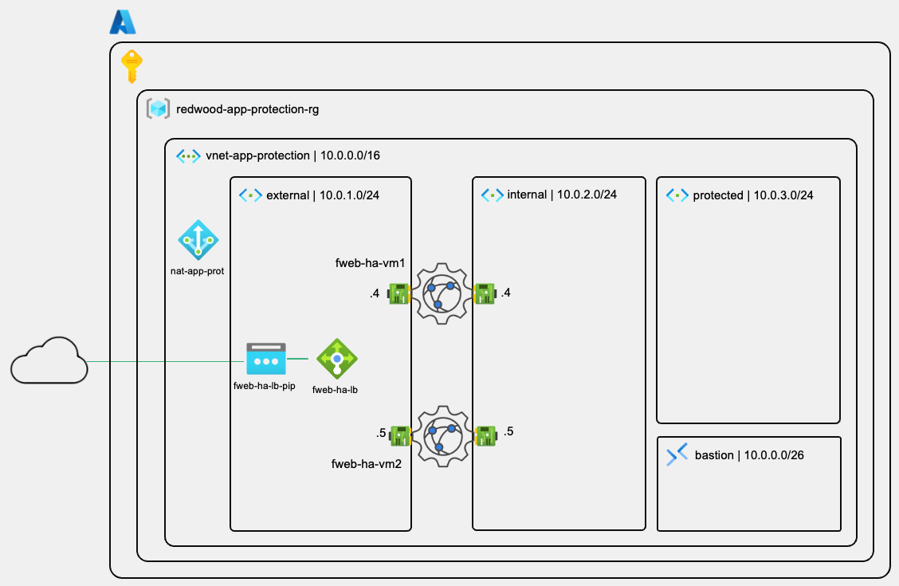

### Business Context

**Redwood Industries' Challenge:**

Redwood Industries is launching their first customer-facing web application on Azure. Their security team has mandated web application firewall (WAF) protection before the application goes live. A single WAF appliance creates an unacceptable single point of failure — their SLA requires 99.9% availability for this customer-facing service.

**The Solution:**

A FortiWeb Active-Active cluster with an Azure External Load Balancer provides:

- **Redundancy:** Two FortiWeb nodes share the traffic load — if one fails, the other continues without interruption
- **Scale:** Active-Active distributes inspection load across both nodes
- **Azure-native resilience:** Load balancer health probes detect failures automatically
- **WAF capabilities:** OWASP Top 10 protection, signature-based and behaviour-based threat detection

---

## Understanding FortiWeb Active-Active HA in Azure

### How Active-Active HA Works

Unlike Active-Passive HA, FortiWeb Active-Active mode means **both nodes handle production traffic simultaneously**. Configuration is kept in sync between nodes using FortiWeb's built-in configuration replication — covered in Lab 2.

```text
Traffic Flow (Active-Active):

Client Request
    │
    ▼
Azure External Load Balancer
    ├── Session A → FortiWeb Node 1 (inspects, forwards to app server)
    ├── Session B → FortiWeb Node 2 (inspects, forwards to app server)
    └── Session C → FortiWeb Node 1 (load balanced)

If Node 1 fails:
    ├── Existing sessions on Node 1: dropped (no session sync in AA mode)
    └── All new sessions → Node 2 (health probe removes Node 1 from rotation)
```

> [!NOTE]
> Active-Active FortiWeb in this workshop will not synchronise session state between nodes. Clients may need to re-establish connections during a node failure. For most HTTP/HTTPS applications, this is transparent to end users as browsers retry automatically.

### Why an ARM Template?

The FortiWeb HA deployment involves multiple interdependent Azure resources: two VMs, network interfaces, availability set (or availability zone), load balancer, backend pools, health probes, and load balancing rules. Deploying these manually would take over an hour and introduce configuration errors. The ARM template creates all resources consistently in minutes, and is the Fortinet-recommended deployment method for production HA clusters.

### The Three-Subnet Design

FortiWeb uses three functional subnets in this architecture:

| Subnet | CIDR | Purpose |
| --- | --- | --- |
| `external` | 10.0.1.0/24 | FortiWeb port1 — internet-facing, management access |
| `internal` | 10.0.2.0/24 | FortiWeb port2 — traffic to/from protected servers |
| `protected` | 10.0.3.0/24 | Application servers (no direct internet access) |

> [!NOTE]
> The `AzureBastionSubnet` (10.0.0.0/24) is a required fourth subnet. Azure Bastion uses it to provide browser-based SSH/RDP access to VMs in the protected subnet — without requiring public IPs on those VMs.

---

## Part A: Create the Resource Group

### Step 1: Create the Resource Group

#### 1.1 Navigate to Resource Groups

1. Log in to the Azure Portal at `https://portal.azure.com`
2. In the top search bar, type `resource groups`
3. Click **Resource groups** in the results

#### 1.2 Create New Resource Group

1. Click **+ Create** at the top of the page
2. Configure the following:

   | Setting | Value |
   | --- | --- |
   | **Subscription** | `Your Azure subscription` |
   | **Resource group** | `redwood-app-protection-rg` |
   | **Region** | `Canada Central` |

3. Click **Review + create**
4. Click **Create**

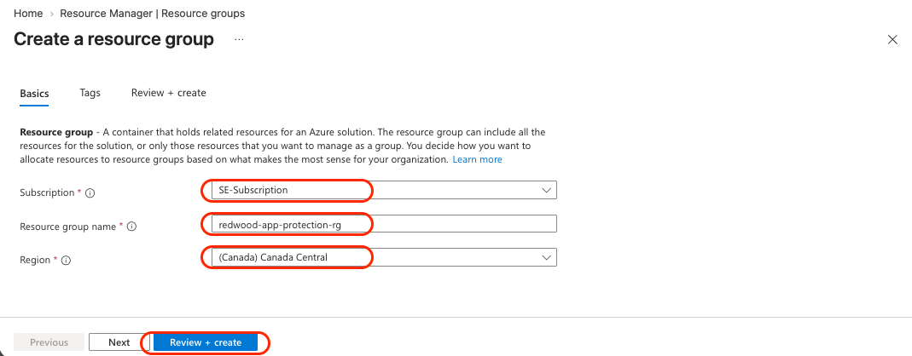

> [!NOTE]
> All AZ-301 resources are deployed into `redwood-app-protection-rg` and the `Canada Central` region. Keeping all resources in one region and one resource group simplifies cleanup at the end of the workshop.

### Validation

- [x] Resource group `redwood-app-protection-rg` created in Canada Central

---

## Part B: Create the Virtual Network, Subnets and NAT Gateway

### Step 2: Create the Virtual Network

#### 2.1 Navigate to Virtual Network Creation

1. Navigate to your resource group: **redwood-app-protection-rg**
2. Click **+ Create**
3. In the Marketplace search field, type `virtual network`
4. Click **Virtual Network** (Microsoft service)
5. Click **Create > Virtual network**

#### 2.2 Configure Basic Settings

1. In the **Basics** tab, configure:

   | Setting | Value |
   | --- | --- |
   | **Subscription** | `Your Azure subscription` |
   | **Resource group** | `redwood-app-protection-rg` |
   | **Name** | `vnet-app-protection` |
   | **Region** | `Canada Central` |

2. Click **Next**

### Step 3: Configure Azure Bastion

#### 3.1 Enable Azure Bastion

1. In the **Security** tab:
   - Select the  **Enable Azure Bastion** box

2. Configure Bastion settings:

   | Setting | Value |
   | --- | --- |
   | **Azure Bastion host name** | `bas-app-protection` |
   | **Azure Bastion public IP address** | Click **Create a public IP address** |
   | **Public IP name** | `bas-app-protection-pip` |
   | **SKU** | Standard (default) |

3. Click **OK** to confirm the public IP

   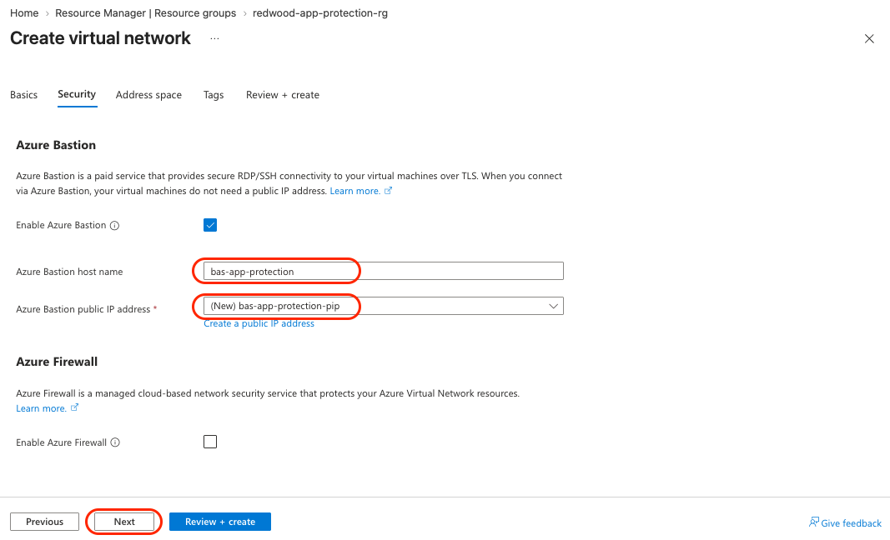

4. Click **Next**

> [!NOTE]
> Azure Bastion deployment typically takes 5–10 minutes after VNet creation. This is expected behaviour for Bastion services.

### Step 4: Configure IP Address Space and Subnets

#### 4.1 Set the VNet Address Space

1. In the **IP Addresses** tab:
   - **IPv4 address space:** `10.0.0.0/16`
  
2. In the **Subnets** space:
   - **Delete** the `default` subnet `10.0.0.0/24`
  
#### 4.2 Verify the Bastion Subnet

The `AzureBastionSubnet` should have been created automatically when you enabled Bastion:

- Verify the name is exactly `AzureBastionSubnet` (Azure requires this exact name)
- Set the address range to `10.0.0.0/26` clicking on the edit pencil in front of it.

> [!WARNING]
> The Bastion subnet name must be exactly `AzureBastionSubnet` — Azure will reject any other name. Do not rename it.

#### 4.3 Create the External Subnet

1. Click **+ Add subnet**
2. Configure:

   | Setting | Value |
   | --- | --- |
   | **Subnet name** | `external` |
   | **Starting address** | `10.0.1.0` |
   | **Size** | `/24` (256 addresses) |

3. Click **Add**

#### 4.4 Create the Internal Subnet

1. Click **+ Add subnet**
2. Configure:

   | Setting | Value |
   | --- | --- |
   | **Subnet name** | `internal` |
   | **Starting address** | `10.0.2.0` |
   | **Size** | `/24` (256 addresses) |

3. Click **Add**

#### 4.5 Create the Protected Subnet

1. Click **+ Add subnet**
2. Configure:

   | Setting | Value |
   | --- | --- |
   | **Subnet name** | `protected` |
   | **Starting address** | `10.0.3.0` |
   | **Size** | `/24` (256 addresses) |

3. Click **Add**

### Step 5: Review and Create the VNet

#### 5.1 Verify All Subnets

1. Click **Review + create**
2. Verify all four subnets are listed:

   | Subnet | Address Range |
   | --- | --- |
   | `AzureBastionSubnet` | 10.0.0.0/26 |
   | `external` | 10.0.1.0/24 |
   | `internal` | 10.0.2.0/24 |
   | `protected` | 10.0.3.0/24 |

3. Click **Create**

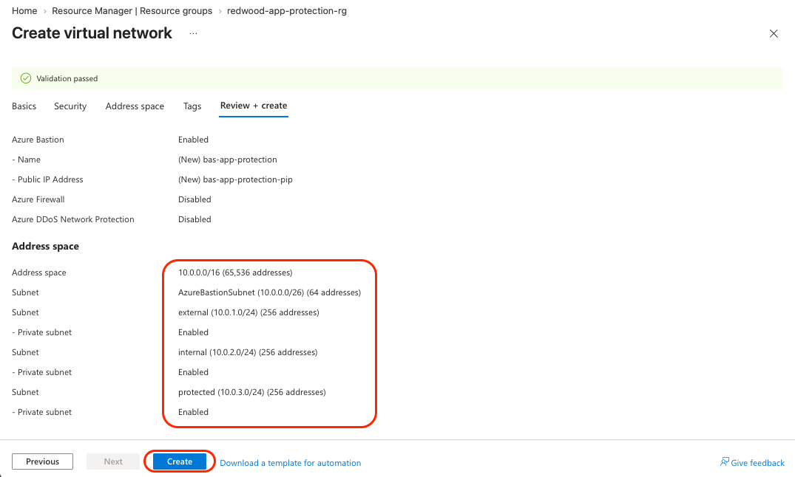

> [!NOTE]
> Wait for the VNet deployment to complete (1–2 minutes) before proceeding. The Bastion resource itself continues deploying in the background — you do not need to wait for it before starting Part C.

### Validation

- [x] VNet `vnet-app-protection` created in Canada Central
- [x] `AzureBastionSubnet` 10.0.0.0/24 present
- [x] `external` subnet 10.0.1.0/24 present
- [x] `internal` subnet 10.0.2.0/24 present
- [x] `protected` subnet 10.0.3.0/24 present

### Step 6: Create a NAT Gateway for the Protected Subnet

Azure no longer provides default outbound internet access for VMs without a public IP. The application servers in the `protected` subnet will not have public IPs — without an explicit outbound method, the custom data script will fail on first boot because the VM cannot reach the internet, therefore the application server will not work.

A NAT Gateway associated with the `protected` subnet solves this by providing a dedicated, predictable public IP for all outbound traffic originating from that subnet.

> [!NOTE]
> The `external` subnet does **not** need a NAT Gateway — the FortiWeb VMs already have explicit public IPs assigned by the ARM template, which take precedence for outbound connectivity.

#### 6.1 Create the NAT Gateway

1. Navigate to `redwood-app-protection-rg`
2. Click **+ Create**
3. In the Marketplace search field, type `nat gateway`
4. Click **NAT gateway** (Microsoft - Azure service)
5. Click **Create > NAT gateway**

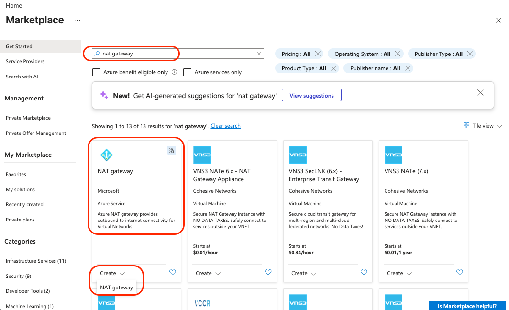

#### 6.2 Configure Basics

1. In the **Basics** tab, configure:

   | Setting | Value |
   | --- | --- |
   | **Subscription** | `Your Azure subscription` |
   | **Resource group** | `redwood-app-protection-rg` |
   | **NAT gateway name** | `nat-app-protection` |
   | **Region** | `Canada Central` |
   | **SKU** | `Standard: Supports zonal deployment` |
   | **Availbility zone** | `No Zone` |
   | **TCP idle timeout (minutes)** | `4` (default) |

2. Click **Next**

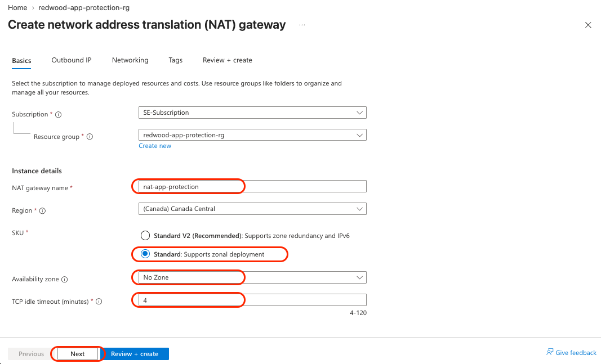

#### 6.3 Create a Public IP for the NAT Gateway

1. In the **Outbound IP** tab, click **Add public IP address or prefixes**
2. In **Manage public IP addresses and prefixes** tab, click on **Create a public IP address**:

   | Setting | Value |
   | --- | --- |
   | **Name** | `nat-app-protection-pip` |
   | **SKU** | `Standard` (default) |

3. Click **OK**
4. Click **Save**
5. Click **Next**

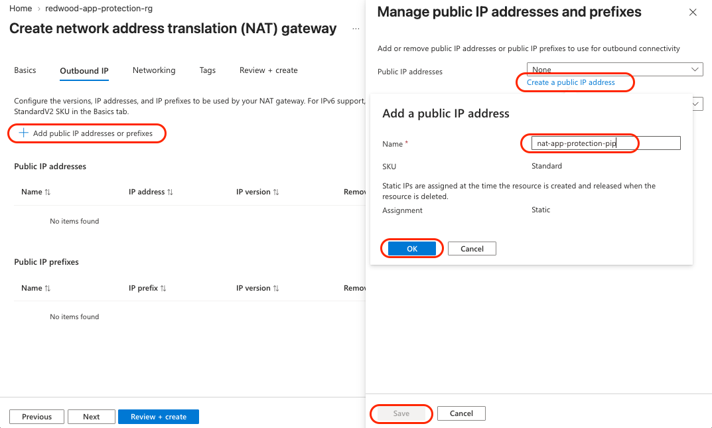

#### 6.4 Associate with the Protected Subnet

1. In the **Networking** tab:
   - **Virtual network:** `vnet-app-protection`
2. In the subnets list, check the box next to `protected`

   > Associate the NAT Gateway with the `protected` subnet **only**. Do not associate it with `external` or `internal` — the FortiWeb nodes have their own public IPs and do not need NAT Gateway outbound access.

3. Click **Review + create**

   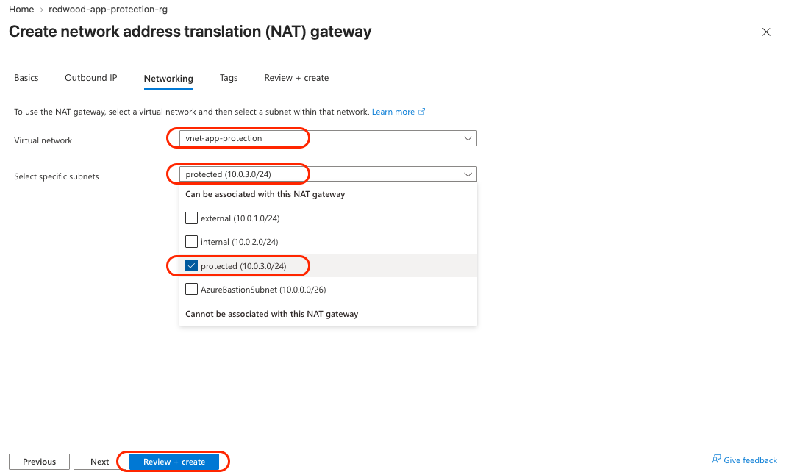

4. Click **Create**

> [!NOTE]
> NAT Gateway deployment typically takes 1–2 minutes. Once deployed, all outbound internet traffic from VMs deployed in the `protected` subnet will use `nat-app-protection-pip` as their source IP — regardless of whether those VMs have a public IP assigned.

#### 6.5 Verify the Association

1. After deployment, click **Go to resource**
2. Click **Settings > Networking** in the left menu
3. Verify `protected` is listed as an associated subnet

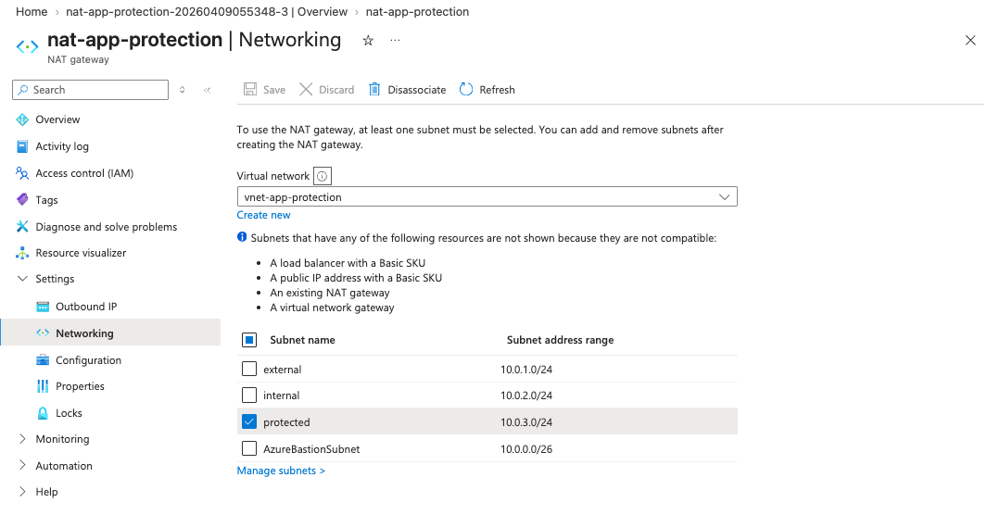

### Validation

- [x] `nat-app-protection` created in Canada Central
- [x] `nat-app-protection-pip` public IP assigned to the NAT Gateway
- [x] NAT Gateway associated with the `protected` subnet only
- [x] `external` and `internal` subnets have no NAT Gateway association

---

## Part C: Prepare for ARM Template Deployment

This template is self-contained. Unlike traditional FortiWeb HA deployments, it does not require an Azure App Registration or service principal — HA operations are handled directly by the template at deploy time. The only thing you need before deploying is your two FortiFlex tokens.

### Step 6: Locate Your FortiFlex Tokens

Each FortiWeb node requires its own FortiFlex token. The tokens are applied directly as ARM template parameters and activate licensing automatically during the first boot sequence.

#### 6.1 Retrieve Your Tokens

Locate the FortiFlex Tokens in your welcome e-mail:

| Token | Description |
| --- | --- |
| **FortiFlex Token A** | Applied to FortiWeb Node 1 (`fweb-ha-vm1`) |
| **FortiFlex Token B** | Applied to FortiWeb Node 2 (`fweb-ha-vm2`) |

> [!TIP]
> Open a text editor (Notepad, VS Code) and paste both tokens now. You will enter them in Step 8 — they are long strings and easy to mistype.  
---
> [!NOTE]
> **How FortiFlex activation works in this template:** The tokens are injected into each VM's `customData` at deployment time. When FortiWeb boots for the first time, it reads the token from `customData` and contacts Fortinet's licensing servers automatically. No manual activation step is required in the GUI.

### Validation

- [x] FortiFlex Token A copied and saved
- [x] FortiFlex Token B copied and saved

---

## Part D: Deploy the FortiWeb HA Cluster

### Step 7: Create the ARM Template Spec

#### 7.1 Navigate to Template Specs

1. Navigate to your resource group: `redwood-app-protection-rg`
2. Click **+ Create**
3. In the **Search the Marketplace** field, type `template specs`
4. In the **Template specs** in the results
5. Click **+ Create > Template Specs**

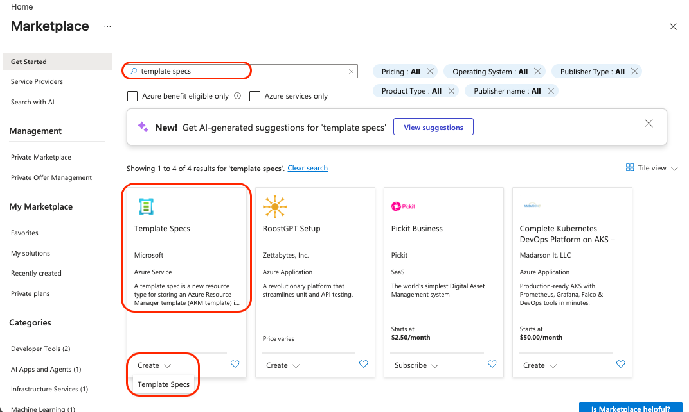

#### 7.2 Configure the Template Spec

1. In the **Basics** tab, configure:

   | Setting | Value |
   | --- | --- |
   | **Subscription** | Your Azure subscription |
   | **Resource group** | `redwood-app-protection-rg` |
   | **Name** | `fortiweb-ha-template` |
   | **Location** | `Canada Central` |
   | **Version** | `v1.0.0` |

2. Click **Next: Edit Template**

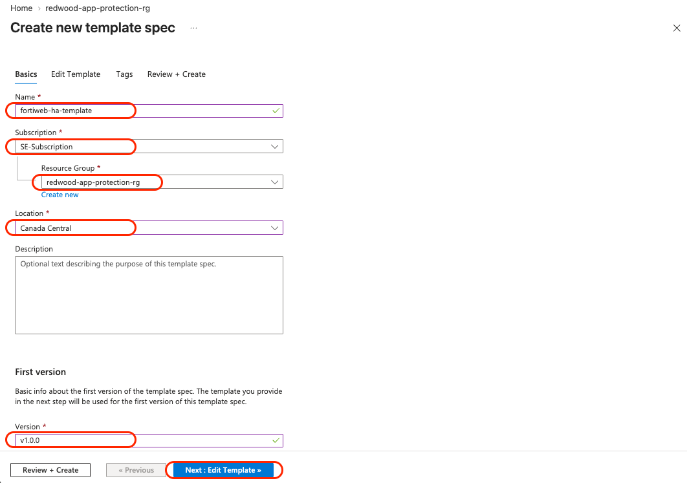

#### 7.3 Paste the ARM Template Content

1. In the template editor, select all existing content and delete it
2. Open the following URL in a new browser tab: [FortiWeb ARM Template](https://raw.githubusercontent.com/regisftm/AZ-301/refs/heads/main/arm-template/deploy_fwb_ha.json)
3. Select all content (`Ctrl+A`) and copy it (`Ctrl+C`)
4. Return to the Azure Portal template editor, delete the pre-populated **Template Content** and and paste (`Ctrl+V`)
5. Click **Review + create**
6. Click **Create**

> [!NOTE]
> The template spec is a reusable container for the ARM template. Creating it first means you can redeploy the same template in future without re-pasting the JSON.

### Step 8: Deploy the FortiWeb HA Cluster

#### 8.1 Open the Template for Deployment

1. After creation, go back to the `redwood-app-protection-rg` and  click the **fortiweb-ha-template** template spec.
2. Click **Deploy**

#### 8.2 Configure Basics

| Setting | Value |
|---|---|
| **Subscription** | Your Azure subscription |
| **Resource group** | `redwood-app-protection-rg` |
| **Region** | `Canada Central` |

#### 8.3 Configure Template Parameters

**Resource Naming:**

| Parameter | Value |
|---|---|
| **Resource Name Prefix** | `fweb-ha` |

> [!NOTE]
> The prefix `fweb-ha` is used to name all resources created by this template. Your FortiWeb VMs will be named `fweb-ha-vm1` and `fweb-ha-vm2`, the load balancer `fweb-ha-loadbalance`, and so on. Keep this prefix — it is referenced throughout  the remaining labs.

**VM Configuration:**

| Parameter | Value |
|---|---|
| **Vm Sku** | `Standard_F2s_v2` |
| **Availability Options** | `Availability Set` |
| **Accelerated Networking** | `false` |
| **Vm Admin Username** | `fortiuser` |
| **Vm Admin Password** | Create a strong password — save it securely |
| **Vm Image Version** | `latest` |

> [!WARNING]
> The admin username cannot be `admin` or `root` — Azure will reject these. Use
> `fortiuser` as shown above.

> [!WARNING]
> The password must satisfy at least 3 of these 4 conditions: uppercase characters, lowercase characters, a digit, a special character. Save this password — you will need it to access both FortiWeb nodes throughout the workshop.

**Network Configuration:**

| Parameter | Value |
|---|---|
| **Vnet New Or Existing** | `existing` |
| **Vnet Resource Group** | `redwood-app-protection-rg` (or just leave the [resourceGroup().name] |
| **Vnet Name** | `vnet-app-protection` |
| **Vnet Address Prefix** | `10.0.0.0/16` |
| **Vnet Subnet1 Name** | `external` |
| **Vnet Subnet1 Prefix** | `10.0.1.0/24` |
| **Vnet Subnet2 Name** | `internal` |
| **Vnet Subnet2 Prefix** | `10.0.2.0/24` |

**Load Balancer:**

| Parameter | Value |
|---|---|
| **Load Balancer Type** | `Public` |

**FortiFlex Licensing:**

| Parameter | Value |
|---|---|
| **Fortiweb License Forti Flex A** | Your FortiFlex Token A (from Step 6.1) |
| **Fortiweb License Forti Flex B** | Your FortiFlex Token B (from Step 6.1) |

> [!NOTE]
> The tokens are injected into each VM's `customData` at deployment time. When each FortiWeb node boots for the first time, it reads the token and contacts Fortinet's licensing servers automatically — no manual activation in the GUI is required.

#### 8.4 Deploy

1. Click **Review + create**
2. Review all parameters — pay particular attention to the VNet name and subnet names,
   which must match exactly what you created in Part B
3. Click **Create**

> [!NOTE]
> The deployment typically takes **8–12 minutes**. The template is simultaneously
> creating: an availability set (or availability zones), two FortiWeb VMs, four network interfaces, three public IP addresses, a load balancer with backend pool, health probes, and load balancing rules. Go brab yourself a coffee or a tea ☕

#### 8.5 Monitor Deployment Progress

1. Click the notification bell 🔔 at the top right to see deployment status
2. For detailed progress, navigate to `redwood-app-protection-rg > Deployments` if you had moved away from the Deployment page.

### Validation

When deployment completes, click on **Go to resource group**, verify the following resources exist in `redwood-app-protection-rg`:

- ✅ `fweb-ha-vm1` — FortiWeb Node 1 (VM)
- ✅ `fweb-ha-vm2` — FortiWeb Node 2 (VM)
- ✅ `fweb-ha-availabilitySet` — Availability set containing both VMs
- ✅ `fweb-ha-loadbalance` — External Load Balancer
- ✅ `fweb-ha-loadbalance-IP` — Load Balancer public IP
- ✅ `fweb-ha-nicPublic-IP1` and `fweb-ha-nicPublic-IP2` — VM management public IPs
- ✅ `fweb-ha-securityGroup` — Network Security Group

---

## Part E: Access FortiWeb and Verify the Cluster

### Step 9: Locate the FortiWeb Management IPs

Each FortiWeb node has its own public IP for management access on port1 (the `external`
subnet interface).

#### 9.1 Find the Public IPs

1. Navigate to `redwood-app-protection-rg`
2. Locate the following public IP resources and note their assigned IP addresses:

| Resource | Purpose |
|---|---|
| `fweb-ha-nic-pip1` | Management access — FortiWeb Node 1 (`fweb-ha-vm1`) |
| `fweb-ha-nic-pip2` | Management access — FortiWeb Node 2 (`fweb-ha-vm2`) |
| `fweb-ha-lb-pip` | Application traffic — shared VIP for both nodes |

> [!TIP]
> Open your text editor and record all three IP addresses now. You will use the
> management IPs in Steps 10–13, and the load balancer IP in Lab 4 when you
> configure and test traffic steering.

### Step 10: Connect to the FortiWeb GUI

#### 10.1 Open the FortiWeb Management Interface — Node 1

1. Open a new browser tab and navigate to:

   ```console
   https://<fweb-ha-nic-pip1>:8443
   ```

1. You will see a certificate warning — this is expected (self-signed certificate)
2. Click **Advanced** → **Proceed** (or the equivalent in your browser)

#### 10.2 Log In

| Field | Value |
|---|---|
| **Username** | `fortiuser` |
| **Password** | The VM admin password you set in Step 8.3 |

> [!NOTE]
> `fortiuser` is the VM operating system administrator account, provisioned by Azure during deployment.

#### 10.3 Verify Licensing Status

After login, navigate to **Dashboard > Status > Licenses** and confirm:

- The **Licenses** section shows a valid **VM License**
- The VM serial number is displayed on the **System Information** tile

> [!NOTE]
> If the license status shows as **Pending** or **Unlicensed**, wait 2–3 minutes and  refresh the page. The node may still be completing its first-boot activation sequence — if activation does not complete within 5 minutes, ask for help!

### Step 11: Configure FortiWeb Configuration Replication

In this deployment, both FortiWeb nodes operate as **Standalone** units with no automatic HA session synchronisation. To keep both nodes identical, we will use a **Manager - Server/Client configuration replication** model where the client node pulls the configuration from the server node as soon as it is modified.

> [!NOTE]
> **Why not automatic HA sync?** The Active-Active mode used in this  deployment relies on the Azure Load Balancer to distribute traffic. Each node inspects its own sessions independently. Configuration replication keeps policies and settings identical across both nodes. The client node fetchs the new configuration after any configuration change in the server node.

#### 11.1 Configure FortiWeb `fweb-ha-vm1` as the Configuration Server

1. Connect to `fweb-ha-vm1` at `https://<fweb-ha-nic-pip1>:8443`
2. Log in with your `fortiuser` credentials
3. Navigate to **System > High Availability > Settings**
4. On **Mode** select **Manager**
5. Configure the following:

   | Setting | Value |
   | --- | --- |
   | **Role** | `Server` |
   | **Server Port** | `996` |
   | **Config Sync Port** | `997` (default) |

6. Click **Apply**

> [!NOTE]
> The Server role means `fweb-ha-vm1` is the **source of truth** for configuration. Any changes you make during this workshop should always be made on `fweb-ha-vm1`  first, then the FortiWeb `fweb-ha-vm2` will automatically pull it.

#### 11.2 Verify the FortiWeb `fweb-ha-vm1` internal IP address

You will use the internal IP address of the FortiWeb `fweb-ha-vm1` to configure the FortiWeb `fweb-ha-vm2` as client.

1. Connect to `fweb-ha-vm1` at `https://<fweb-ha-nic-pip1>:8443`
2. Log in with your `fortiuser` credentials
3. Navigate to **Network > Interface**
4. Copy the port2 IP address to you notepad.

#### 11.3 Configure `fweb-ha-vm2` as the Configuration Client

1. Open a new browser tab and connect to `fweb-ha-vm2` at `https://<fweb-ha-nic-pip2>:8443`
2. Log in with your `fortiuser` credentials
3. Navigate to **System > High Availability > Settings**
4. Click **Manager**
5. Configure the following:

   | Setting | Value |
   | --- | --- |
   | **Role** | `Client` |
   | **(Server) IP** | IP address of port2 of `fweb-ha-vm1`|
   | **Server Port** | `996` (default) |
   | **Config Sync Port** | `997` (default) |

6. Click **Apply**

#### 11.4 Verify the Sync Completed Successfully

1. On `fweb-ha-vm1`, navigate to **Dashboard > Status > System Information**
2. Confirm that you have both FortWeb instances in the **Manager Members**
3. In the top bar, where the HA status is showned, the following state should be observed:
   - On `fweb-ha-vm1` (Server): **HA: In Sync**
   - On `fweb-ha-vm2` (Client): **HA: Client**

#### 11.5 Test the Configuration Synchornization

1. Log on each FortiWeb instance and navigate to **System > Maintenance > System Time**.
2. Note the Time Zone on each of them.
3. In the FortiWeb `fweb-ha-vm1` change the timezone to **(GMT) Greenwich Mean Time: Dublin,Edinburgh,Lisbon,London**
4. Confirm clickin **OK**
5. Accept the new **Time Settings** configuration clicking **OK**
6. The Time Zone configuration on the `fweb-ha-vm2` must have been synchronized and matching the `fweb-ha-vm1`

### Validation

- [ ] `fweb-ha-vm1` configured as configuration **Server** on port 996
- [ ] `fweb-ha-vm2` configured as configuration **Client** pointing to `fweb-ha-vm1`s private IP
- [ ] Initial sync triggered and completed successfully
- [ ] `fweb-ha-vm2` configuration matches `fweb-ha-vm1`

---

## Challenge! ⚔️

The External Load Balancer distributes incoming traffic across both FortiWeb nodes using a hash-based algorithm. However, web application sessions often span multiple HTTP requests — and all requests for the same session must reach the **same** FortiWeb node to maintain session state. What Azure Load Balancer feature ensures this? Configure the external loadbalancer properly.

---

## Lab 1 Complete! 🎉

### What You've Accomplished

✅ **Resource Group Created:**
- `redwood-app-protection-rg` in Canada Central

✅ **Virtual Network Deployed:**
- `vnet-app-protection` (10.0.0.0/16)
- Four subnets: `AzureBastionSubnet`, `external`, `internal`, `protected`

✅ **Azure Bastion Configured:**
- Browser-based secure access to private VMs — no public IPs required on app servers

✅ **FortiWeb HA Cluster Deployed via ARM Template:**
- `fweb-ha-vm1` and `fweb-ha-vm2` running as standalone nodes
- Azure External Load Balancer (`fweb-ha-loadbalance`) distributing traffic
- FortiFlex tokens activated automatically on first boot
- Both nodes in Availability Set for SLA coverage

✅ **Configuration Replication Established:**
- Node 1 (`fweb-ha-vm1`) designated as configuration Server
- Node 2 (`fweb-ha-vm2`) designated as configuration Client
- Initial sync completed — both nodes are identical

### Architecture Review
```text
redwood-app-protection-rg (Canada Central)
│
├── vnet-app-protection (10.0.0.0/16)
│   ├── AzureBastionSubnet  (10.0.0.0/24)
│   ├── external            (10.0.1.0/24)  ← FortiWeb port1 (management + traffic)
│   ├── internal            (10.0.2.0/24)  ← FortiWeb port2 (to app servers)
│   └── protected           (10.0.3.0/24)  ← App servers [deployed in Lab 3]
│
├── bas-app-protection                      ← Azure Bastion
├── bas-app-protection-pip                  ← Bastion public IP
│
├── fweb-ha-loadbalance (External LB)       ← Ports 80/443 — fweb-ha-loadbalance-IP
│   └── FwbHaLBBackendAddrPool
│       ├── fweb-ha-vm1 (Node 1 — Server)  ← fweb-ha-nicPublic-IP1
│       └── fweb-ha-vm2 (Node 2 — Client)  ← fweb-ha-nicPublic-IP2
│
├── fweb-ha-availabilitySet
├── fweb-ha-securityGroup
└── [App servers — deployed in Lab 3]
```

### Key Takeaways

1. **ARM templates eliminate deployment errors:** Multi-resource HA deployments have many interdependencies. Templates ensure consistent, repeatable deployments that match Fortinet's reference architecture.

2. **FortiFlex via customData:** Tokens are injected at deployment time and activate automatically on first boot. No storage accounts, no manual GUI activation required — this is the simplest BYOL deployment path for FortiWeb on Azure.

3. **Active-Active means both nodes are always working:** Unlike the Active-Passive FortiGate HA in AZ-102, there is no standby node sitting idle. Both FortiWeb nodes inspect traffic simultaneously — configuration replication keeps them in sync.

4. **Server/Client replication is manual and intentional:** You control when Node 2 receives updates. This means Node 1 is always your authoritative configuration source — make all changes there first, then sync.

5. **Three public IPs serve different purposes:** The load balancer IP   (`fweb-ha-loadbalance-IP`) is the application VIP — clients connect here. The node IPs (`fweb-ha-nicPublic-IP1`, `fweb-ha-nicPublic-IP2`) are for management access only.

### Validation Checklist

Before proceeding to Lab 2, verify:

**Infrastructure:**
- ✅ `redwood-app-protection-rg` exists in Canada Central
- ✅ `vnet-app-protection` has all four subnets with correct CIDRs
- ✅ Azure Bastion deployed (`bas-app-protection`)

**FortiWeb Cluster:**
- ✅ `fweb-ha-vm1` and `fweb-ha-vm2` both running
- ✅ GUI accessible on both nodes at port 8443
- ✅ FortiFlex licences valid on both nodes
- ✅ Node 1 configured as configuration Server (port 996)
- ✅ Node 2 configured as configuration Client pointing to Node 1
- ✅ Initial configuration sync completed successfully

> [!NOTE]
> The loadbalnacer will show both FortWeb backends as `Down` as we don't have the application server in place yet. The application server deployment will be done in Lab 2.

### Next Steps

Ready for **Lab 2: Application Server Deployment!**

In Lab 2, you will:

- Deploy two Ubuntu application servers into the `protected` subnet
- Use Azure Bastion to connect to the servers without public IPs
- Install and verify the Redwood Industries demo web application
- Confirm end-to-end connectivity from FortiWeb to the application servers

---

## Troubleshooting Reference

### Issue: ARM Template Deployment Fails

Navigate to `redwood-app-protection-rg > Deployments`, click the failed deployment, and read the **Error** section — it typically identifies the exact parameter causing the failure.

**Common causes:**

- **VNet or subnet name mismatch:** The template parameters `vnetName`, `vnetSubnet1Name`, and `vnetSubnet2Name` must match exactly what you created in Part B — including case - **Resource group mismatch:** Ensure `vnetResourceGroup` is set to `redwood-app-protection-rg` exactly
- **VM SKU not available:** `Standard_F2s_v2` may not be available in all Azure
subscriptions — check quota under **Subscriptions > Usage + quotas**

### Issue: Cannot Access FortiWeb GUI

1. Verify you are using `https://` and port `8443` (not 443 or 8080)
2. Accept the certificate warning — the self-signed certificate is expected
3. Verify the VM shows **Running** state (not **Starting** or **Deallocated**)
4. The NSG `fweb-ha-securityGroup` created by the template already allows port 8443 inbound — if access still fails, verify no other NSG is applied to the subnet

### Issue: FortiFlex Licence Not Activating

1. Wait 5 minutes — first-boot `customData` processing takes time
2. Verify the FortiWeb VM has internet connectivity (outbound to Fortinet's servers)
3. Check that your FortiFlex token has not already been consumed by another VM (check with the instructor)
4. Navigate to **Dashboard > Status > Licenses** and look for any licence error messages

### Issue: Configuration Sync Fails

1. Verify Node 1's (`fweb-ha-vm1`) private IP is entered correctly on Node 2's (`fweb-ha-vm2`) Client configuration
2. Verify both nodes are in **Running** state before attempting sync
3. Check **System > High Availability > Settings > Manager** on Node 1 — confirm it shows the Server role is active
4. Open the console on `fweb-ha-vm1` and execute `get system manager` and `get system manager-status` to verify the configurations and status of both nodes

<!--
### Issue: Load Balancer Shows Nodes as Unhealthy

1. Wait 3–5 minutes after deployment — nodes take time to fully boot
2. Verify both VMs are in **Running** state
3. The template configures health probes on TCP ports 80 and 443 — FortiWeb listens
   on these ports by default
4. Confirm the NSG `fweb-ha-securityGroup` has not been modified — it must allow
   inbound traffic from `168.63.129.16` (Azure's health probe source IP)
-->

---

*Lab Guide Version 1.0 — April 2026*

*Next: [Lab 2 — Application Server Deployment](/az-301-lab2/README.md)*
