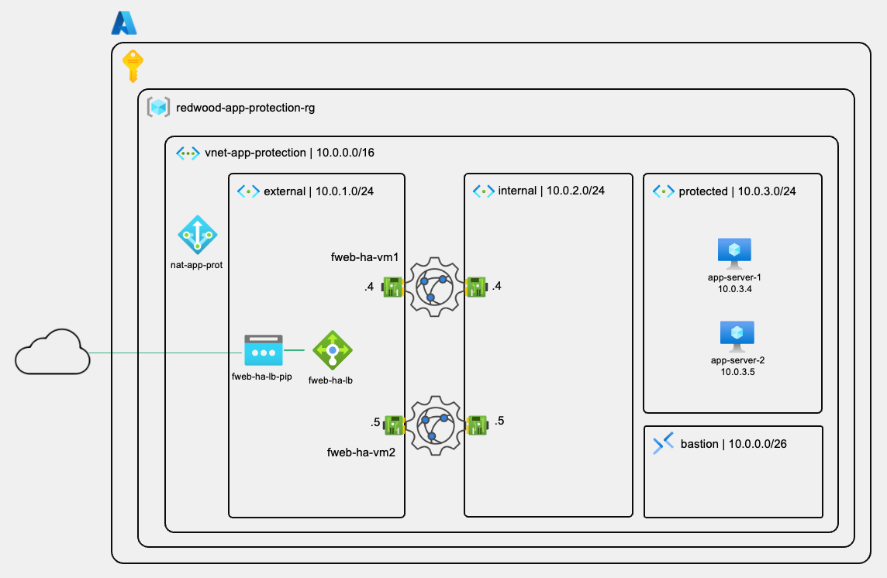
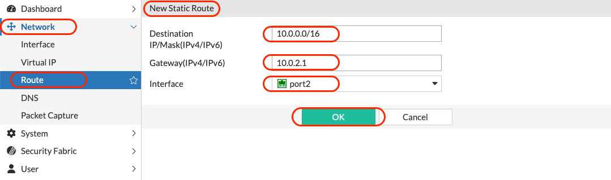
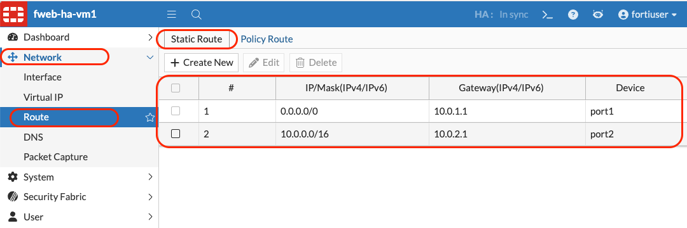

# Lab 2: Application Server Deployment

## Lab Overview

**Duration:** 30 minutes  
**Difficulty:** Beginner  
**Prerequisites:** Completed Lab 1 — `redwood-app-protection-rg`, `vnet-app-protection`, and both FortiWeb nodes must be running before starting this lab

### Objective

Deploy two Ubuntu application servers into the `protected` subnet to simulate Redwood Industries' web application. The servers are deployed without public IPs and accessed exclusively via Azure Bastion. A demo web application is installed automatically via a custom data script at first boot — this application will be used for WAF testing in Labs 3 and 4.

### What You'll Build

By the end of this lab, you will have:

- ✅ Two Ubuntu 24.04 LTS application servers in the `protected` subnet
- ✅ No public IPs on either server — access only via Azure Bastion
- ✅ Redwood Industries demo web application installed and running on both servers
- ✅ End-to-end connectivity verified from FortiWeb to both application servers
- ✅ Application behaviour validated — normal state and simulated attack state

### Architecture



### Business Context

**Redwood Industries' Requirement:**

The application servers hosting the customer-facing web application must not be directly reachable from the internet — all traffic must flow through the FortiWeb WAF cluster. Assigning public IPs to the application servers would create a bypass path, making WAF
protection ineffective. Operators still need a way to manage the servers securely  without exposing them.

**The Solution:**

- Application servers are placed in the `protected` subnet with **no public IPs**
- **Azure Bastion** provides browser-based SSH access for management — no jump host, no   VPN required
- All application traffic reaches the servers exclusively through FortiWeb's `internal`   interface (port2)
- The demo application simulates a realistic web workload with common vulnerabilities — making it ideal for demonstrating WAF protection in Labs 3 and 4

---

## Understanding the Demo Application

### What the Application Does

The Redwood Industries demo application (`ubuntu-website`) is a web application designed for WAF demonstration. It serves a simple web page that:

- **Normal state:** Renders a page with a random colour background and the server hostname — useful for confirming which backend node is serving the request
- **Attack state:** When a malicious URL parameter is detected, the page switches to a dark red flickering background, displays a warning banner, and shows the attack type, payload, parameter name, and full URL

### Attack Types the Application Detects

| Attack Type | Example Payload |
| --- | --- |
| SQL Injection | `?name=' OR 'x'='x` |
| Cross-Site Scripting (XSS) | `?name=<script>alert(1)</script>` |
| Path Traversal | `?file=../../etc/passwd` |
| Command Injection | `?cmd=;cat /etc/shadow` |

> [!NOTE]
> Detection in the demo application is **client-side only** — it is intentionally visual and educational. In Labs 3 and 4, FortiWeb provides the actual server-side blocking.
> The application's attack state visually confirms what an **unprotected** workload looks like before WAF policies are applied.

---

## Part A: Deploy the First Application Server

### Step 1: Create `app-server-1`

#### 1.1 Navigate to Virtual Machine Creation

1. Navigate to `redwood-app-protection-rg`
2. Click **+ Create**
3. In the Marketplace search field, type `virtual machine`
4. Click **Virtual machine** (Microsoft - Azure Service)
5. Click **Create > Virtual machine**

#### 1.2 Configure Basics

1. In the **Basics** tab, configure:

   | Setting | Value |
   | --- | --- |
   | **Subscription** | Your Azure subscription |
   | **Resource group** | `redwood-app-protection-rg` |
   | **Virtual machine name** | `app-server-1` |
   | **Region** | `Canada Central` |
   | **Availability options** | `No infrastructure redundancy required` |
   | **Security type** | `Standard` |
   | **Image** | `Ubuntu Server 24.04 LTS - x64 Gen2` |
   | **Size** | `Standard_B1ls` (1 vCPU, 0.5 GiB memory) |

> [!TIP]
> To find `Standard_B1ls`, click **See all sizes** and search for `B1ls`. It is the smallest and most cost-effective size — sufficient for a demo application server. If this vm size is not available in your subscription feel free to use any other similar to that, keeping your cost low.

#### 1.3 Configure Authentication

1. In the **Administrator account** section, configure:

   | Setting | Value |
   | --- | --- |
   | **Authentication type** | `Password` |
   | **Username** | `azureuser` |
   | **Password** | Create a strong password — save it securely |
   | **Confirm password** | Re-enter your password |

2. In the **Inbound port rules** section:
   - **Public inbound ports:** `None`

> [!WARNING]
> Setting **Public inbound ports** to `None` is critical. This ensures the VM has no direct internet exposure. All access is through Azure Bastion or FortiWeb — never directly from the internet.

#### 1.4 Configure Disks

1. Click **Next: Disks >**
2. Keep all default settings

#### 1.5 Configure Networking

1. Click **Next: Networking >**
2. In the **Networking** tab, configure:

   | Setting | Value |
   | --- | --- |
   | **Virtual network** | `vnet-app-protection` |
   | **Subnet** | `protected (10.0.3.0/24)` |
   | **Public IP** | `None` |
   | **NIC network security group** | `Basic` |

> [!WARNING]
> Verify that **Public IP** is set to `None`. If Azure pre-populates this field with a new public IP, click the dropdown and select **None** explicitly.

#### 1.6 Configure Custom Data

The demo application is installed automatically at first boot using a custom data script.

1. Click **Next: Management >**
2. Click **Next: Monitoring >**
3. Click **Next: Advanced >**
4. In the **Advanced** tab, locate the **Custom data** field
5. Paste the following script:

   ```bash
   #!/bin/bash
   git clone https://github.com/regisftm/ubuntu-website.git
   cd ubuntu-website
   chmod 755 install.sh
   ./install.sh
   ```


> [!NOTE]
> The custom data script clones the demo application repository and runs the installer.
> The script executes once during the first boot — it runs in the background and may take 2–3 minutes to complete after the VM reaches **Running** state. The application will be available on port 80 once installation finishes.

#### 1.7 Review and Create

1. Click **Review + create**
2. Verify the following before creating:
   - **Subnet:** `protected`
   - **Public IP:** `None`
   - **Image:** `Ubuntu Server 24.04 LTS`
3. Click **Create**

> [!NOTE]
> While `app-server-1` deploys, proceed immediately to Part B to create `app-server-2` in parallel — both VMs can deploy simultaneously.

---

## Part B: Deploy the Second Application Server

### Step 2: Create `app-server-2`

#### 2.1 Navigate to Virtual Machine Creation

1. Navigate to `redwood-app-protection-rg`
2. Click **+ Create**
3. Search for `virtual machine`
4. Click **Create > Azure virtual machine**

#### 2.2 Configure Basics

Use the same configuration as `app-server-1` with one change:

| Setting | Value |
| --- | --- |
| **Subscription** | Your Azure subscription |
| **Resource group** | `redwood-app-protection-rg` |
| **Virtual machine name** | `app-server-2` |
| **Region** | `Canada Central` |
| **Availability options** | `No infrastructure redundancy required` |
| **Security type** | `Standard` |
| **Image** | `Ubuntu Server 24.04 LTS - x64 Gen2` |
| **Size** | `Standard_B1ls` (1 vCPU, 0.5 GiB memory) |

#### 2.3 Configure Authentication

| Setting | Value |
| --- | --- |
| **Authentication type** | `Password` |
| **Username** | `azureuser` |
| **Password** | Use the **same password** as `app-server-1` |
| **Public inbound ports** | `None` |

> [!TIP]
> Using the same credentials on both servers simplifies management throughout the
> workshop — you only need to remember one set of credentials.

#### 2.4 Configure Networking

| Setting | Value |
| --- | --- |
| **Virtual network** | `vnet-app-protection` |
| **Subnet** | `protected (10.0.3.0/24)` |
| **Public IP** | `None` |
| **NIC network security group** | `Basic` |

#### 2.5 Configure Custom Data

1. Click **Next: Management > Next: Monitoring > Next: Advanced**
2. Paste the same custom data script:

   ```bash
   #!/bin/bash
   git clone https://github.com/regisftm/ubuntu-website.git
   cd ubuntu-website
   chmod 755 install.sh
   ./install.sh
   ```

#### 2.6 Review and Create

1. Click **Review + create**
2. Verify subnet is `protected` and Public IP is `None`
3. Click **Create**

### Validation

When both deployments complete, navigate to `redwood-app-protection-rg` and verify:

- [x] `app-server-1` — Status: **Running**, no public IP, subnet: `protected`
- [x] `app-server-2` — Status: **Running**, no public IP, subnet: `protected`

#### Note the Private IP Addresses

1. Click on `app-server-1` > **Overview**
2. Note the **Private IP address** (will be in the `10.0.3.x` range)
3. Repeat for `app-server-2`

   | Server | Private IP |
   | --- | --- |
   | `app-server-1` | `10.0.3.___` |
   | `app-server-2` | `10.0.3.___` |

> [!TIP]
> Record these IP addresses in your text editor — you will need them in Lab 3 when configuring the FortiWeb Server Pool.

---

## Part C: Verify the Application Servers

### Step 3: Connect via Azure Bastion

Azure Bastion provides browser-based SSH access to VMs in the `protected` subnet without requiring public IPs or a jump host.

#### 3.1 Connect to `app-server-1`

1. Navigate to `redwood-app-protection-rg`
2. Click on `app-server-1`
3. Click **Connect** in the top menu
4. Select **Connect via Bastion**
5. Configure the connection:

   | Setting | Value |
   | --- | --- |
   | **Authentication Type** | `VM Password` |
   | **Username** | `azureuser` |
   | **Password** | `Your app-server-1 password` |

6. Click **Connect**

> [!NOTE]
> A new browser tab opens with a terminal session inside the Azure Portal. This is your SSH session — no additional software required. If the tab is blocked, allow pop-ups for `portal.azure.com`.

#### 3.2 Verify the Application is Running

In the Bastion terminal, run:

```bash
systemctl status nginx.service
```

Expected output:

```console
● nginx.service - A high performance web server and a reverse proxy server
     Loaded: loaded (/usr/lib/systemd/system/nginx.service; enabled; preset: enabled)
     Active: active (running) since Tue 2026-04-07 15:37:07 UTC; 58min ago
       Docs: man:nginx(8)
   Main PID: 2317 (nginx)
      Tasks: 2 (limit: 386)
     Memory: 1.7M (peak: 10.8M)
        CPU: 39ms
     CGroup: /system.slice/nginx.service
             ├─2317 "nginx: master process /usr/sbin/nginx -g daemon on; master_process on;"
             └─2319 "nginx: worker process"

Apr 07 15:37:07 app-server-2 systemd[1]: Starting nginx.service - A high performance web server and a reverse proxy server...
```

If the service is not yet running (first boot still in progress), wait 2 minutes and retry.

#### 3.3 Test the Application Locally

Confirm the application is listening on port 80:

```bash
curl -I http://localhost
```

Expected result:

```console
HTTP/1.1 200 OK
Server: nginx/1.24.0 (Ubuntu)
Date: Thu, 09 Apr 2026 16:08:46 GMT
Content-Type: text/html
Content-Length: 8495
Last-Modified: Thu, 09 Apr 2026 16:01:09 GMT
Connection: keep-alive
ETag: "69d7cd45-212f"
Accept-Ranges: bytes
```

> [!NOTE]
> If `curl` returns a connection refused error, the installer is still running. Wait 1–2 minutes and try again. You can monitor progress with: `tail -f /var/log/cloud-init-output.log`

#### 3.4 Verify `app-server-2`

1. Open a second Bastion session to `app-server-2` following the same steps
2. Repeat Steps 3.2 and 3.3

> [!TIP]
> Keep both Bastion sessions open in separate browser tabs — you will use them for
> connectivity testing in Part D.

### Validation

- [x] Bastion session established to `app-server-1`
- [x] `nginx.service` active and running on `app-server-1`
- [x] Application responding on `localhost` on `app-server-1`
- [x] Bastion session established to `app-server-2`
- [x] `nginx.service` active and running on `app-server-2`
- [x] Application responding on `localhost` on `app-server-2`

---

## Part D: Configure FortiWeb Routing and Verify Connectivity

### Step 4: Add a Static Route for the Internal Network

Right now, FortiWeb has a single static route sending all traffic (0.0.0.0/0) via
`port1` (the `external` subnet gateway at `10.0.1.1`). Without an additional route,
packets destined for the application servers in `10.0.0.0/16` would exit via `port1` instead of `port2`.

A static route for `10.0.0.0/16` via `port2` ensures that all traffic destined for the VNet address space leaves FortiWeb through the internal interface.

> [!NOTE]
> This route covers the entire `vnet-app-protection` address space (`10.0.0.0/16`), which includes the `internal` (10.0.2.0/24) and `protected` (10.0.3.0/24) subnets. Azure's default gateway on `port2` (`10.0.2.1`) will handle the forwarding from there.

#### 4.1 Add the Static Route on `fweb-ha-vm1`

1. Connect to `fweb-ha-vm1` at `https://<fweb-ha-nic-pip1>:8443`
2. Log in with your `fortiuser` credentials
3. Navigate to **Network > Route**
4. Click **+ Create New** in the **Static Route** tab
5. Configure the following:

   | Setting | Value |
   | --- | --- |
   | **Destination IP/Mask** | `10.0.0.0/16` |
   | **Gateway** | `10.0.2.1` |
   | **Interface** | `port2` |

6. Click **OK**



> [!NOTE]
> The gateway `10.0.2.1` is the default Azure gateway for the `internal` subnet (`10.0.2.0/24`). Azure always reserves the first usable IP in each subnet as the default gateway.

#### 4.2 Verify the Routing Table on `fweb-ha-vm1`

1. Navigate to **Network > Static Route**
2. Confirm two routes are present:

   | Destination | Gateway | Interface |
   | --- | --- | --- |
   | `0.0.0.0/0` | `10.0.1.1` | `port1` |
   | `10.0.0.0/16` | `10.0.2.1` | `port2` |



#### 4.3 Sync the Configuration to `fweb-ha-vm2`

Since `fweb-ha-vm2` is configured as the Client, it will automatically pull the updated configuration from `fweb-ha-vm1`. Verify the sync completed:

1. Connect to `fweb-ha-vm2` at `https://<fweb-ha-nic-pip2>:8443`
2. Navigate to **Network > Static Route**
3. Confirm the same two routes are present on `fweb-ha-vm2`

### Step 5: Ping the Application Servers from FortiWeb

With the static route in place, traffic to `10.0.0.0/16` now correctly exits via
`port2`. Verify end-to-end connectivity to both application servers.

#### 5.1 Open the FortiWeb CLI Console

1. Connect to `fweb-ha-vm1` at `https://<fweb-ha-nic-pip1>:8443`
2. Click the **CLI Console** icon in the top-right toolbar

#### 5.2 Ping `app-server-1`

```bash
execute ping <app-server-1-private-ip>
```

Expected output:

```console
PING 10.0.3.x (10.0.3.x): 56 data bytes
64 bytes from 10.0.3.x: icmp_seq=1 ttl=64 time=1.0 ms
64 bytes from 10.0.3.x: icmp_seq=2 ttl=64 time=1.1 ms
64 bytes from 10.0.3.x: icmp_seq=3 ttl=64 time=0.8 ms
64 bytes from 10.0.3.x: icmp_seq=4 ttl=64 time=0.8 ms
64 bytes from 10.0.3.x: icmp_seq=5 ttl=64 time=1.1 ms

--- 10.0.3.x ping statistics ---
5 packets transmitted, 5 packets received, 0% packet loss
round-trip min/avg/max = 0.8/0.9/1.1 ms
```

#### 5.3 Ping `app-server-2`

```bash
execute ping <app-server-2-private-ip>
```

#### 5.4 Test HTTP Connectivity to the Application

From the FortiWeb CLI console, verify nginx is reachable on port 80:

```bash
execute telnettest <app-server-1-private-ip>:80
```

Expected result:

```console
Connected
```

A successful connection opens a socket. Press `Enter` then type `exit` to exit.

Repeat for `app-server-2`:

```bash
execute telnet <app-server-2-private-ip>:80
```

> [!NOTE]
> Connectivity from `fweb-ha-vm2` will be identical since the static route was synced
> in Step 4.3. You do not need to repeat these tests on Node 2.

### Validation

- [x] Static route `10.0.0.0/16` via `10.0.2.1` (`port2`) created on `fweb-ha-vm1`
- [x] Route confirmed present on `fweb-ha-vm2` via config sync
- [x] Ping to `app-server-1` private IP successful from `fweb-ha-vm1`
- [x] Ping to `app-server-2` private IP successful from `fweb-ha-vm1`
- [x] TCP port 80 reachable on both application servers from FortiWeb

---

## Lab 2 Complete! 🎉

### What You've Accomplished

✅ **Two Application Servers Deployed:**

- `app-server-1` in `protected` subnet — no public IP
- `app-server-2` in `protected` subnet — no public IP

✅ **Demo Application Installed:**

- Redwood Industries web application running on both servers
- Application verified locally via `curl` in the Bastion terminal

✅ **FortiWeb Connectivity Verified:**

- `fweb-ha-vm1` can reach both application servers via ICMP and TCP
- End-to-end path from FortiWeb `port2` → `protected` subnet confirmed

### Architecture Review

```text
redwood-app-protection-rg (Canada Central)
│
├── vnet-app-protection (10.0.0.0/16)
│   ├── AzureBastionSubnet  (10.0.0.0/26)
│   ├── external            (10.0.1.0/24)  ← FortiWeb port1
│   ├── internal            (10.0.2.0/24)  ← FortiWeb port2
│   └── protected           (10.0.3.0/24)
│       ├── app-server-1 (10.0.3.x)        ← No public IP, port 3000
│       └── app-server-2 (10.0.3.x)        ← No public IP, port 3000
│
├── bas-app-protection                      ← Bastion (management access to protected)
│
├── fweb-ha-loadbalance (External LB)
│   └── FwbHaLBBackendAddrPool
│       ├── fweb-ha-vm1 ✅ connectivity to app servers verified
│       └── fweb-ha-vm2
│
└── fweb-ha-availabilitySet
```

### Key Takeaways

1. **No public IPs on application servers is a design requirement, not a limitation:** Exposing application servers directly to the internet would bypass FortiWeb entirely. The `protected` subnet with no public IPs enforces that all traffic flows through the WAF.

2. **Azure Bastion eliminates the need for a jump host:** In traditional deployments, a separate bastion VM would be required to access private servers. Azure Bastion provides browser-based SSH at the subnet level — no additional VM, no additional cost beyond the Bastion service itself.

3. **Custom data scripts enable consistent server provisioning:** Both application servers received identical software via the same custom data script — no manual installation steps, no configuration drift between nodes.

4. **FortiWeb's `port2` is the internal traffic interface:** All communication between FortiWeb and the application servers flows through `port2` in the `internal` subnet. The `protected` subnet is reachable from `internal` via Azure's default routing — no route tables required for this traffic path.

### Validation Checklist

Before proceeding to Lab 3, verify:

**Application Servers:**

- ✅ `app-server-1` running in `protected` subnet — no public IP
- ✅ `app-server-2` running in `protected` subnet — no public IP
- ✅ Private IP addresses recorded for both servers

**Application:**

- ✅ `nginx.service` active on both servers
- ✅ Application responding on both servers

**Connectivity:**

- [ ] FortiWeb `fweb-ha-vm1` can ping both application servers
- [ ] TCP port 80 reachable from FortiWeb

### Next Steps

Ready for **Lab 3: FortiWeb Traffic Steering!**

In Lab 3, you will:

- Create a **Server Pool** on FortiWeb pointing to both application servers on port 3000
- Configure a **Virtual Server** binding to FortiWeb's `port1` interface
- Create a **Server Policy** connecting the Virtual Server to the Server Pool
- Test end-to-end traffic flow through the load balancer → FortiWeb → application server
- Observe the application responding through FortiWeb for the first time

---

## Troubleshooting Reference

### Issue: VM Deployment Fails

**Common causes:**

- **Size not available:** `Standard_B1ls` may have limited quota in some subscriptions. Check **Subscriptions > Usage + quotas** and request an increase if needed, or use `Standard_B1s` as an alternative

- **Subnet not found:** Verify `vnet-app-protection` exists and the `protected` subnet is configured with address range `10.0.3.0/24`

- **Duplicate VM name:** Ensure `app-server-1` and `app-server-2` do not already exist in the resource group

### Issue: Cannot Connect via Azure Bastion

1. Verify Azure Bastion (`bas-app-protection`) shows **Succeeded** in the resource group — Bastion can take up to 10 minutes to fully deploy after VNet creation
2. Confirm the VM is in **Running** state (not **Starting**)
3. Verify the `AzureBastionSubnet` subnet is present in `vnet-app-protection`
4. Try a different browser if the Bastion tab does not open — Chrome and Edge are the most reliable

### Issue: Application Not Running After First Boot

1. Connect via Bastion and check the cloud-init log:

   ```bash
   tail -f /var/log/cloud-init-output.log
   ```

2. If the script is still running, wait for it to complete
3. If the script failed, check for errors in the log and re-run manually:

   ```bash
   git clone https://github.com/regisftm/ubuntu-website.git
   cd ubuntu-website
   chmod 755 install.sh
   ./install.sh
   ```

### Issue: FortiWeb Cannot Ping Application Servers

1. Verify the application servers are in the `protected` subnet (`10.0.3.0/24`) — not
   in `internal` or `external`
2. Check that no NSG is applied to the `protected` subnet blocking ICMP
3. Verify the FortiWeb `port2` interface is in the `internal` subnet (`10.0.2.0/24`)
   by navigating to **Network > Interface** on `fweb-ha-vm1`
4. Both subnets are in `vnet-app-protection` — Azure routes between them by default.
   No User-Defined Routes are needed for this traffic path

### Issue: Port 80 Not Reachable from FortiWeb

1. Confirm `nginx.service` is running on the target server (connect via Bastion
   and run `systemctl status nginx.service`)
2. Verify the application is bound to `0.0.0.0:80` (listening on all interfaces):

   ```bash
   ss -tlnp | grep 3000
   ```

3. Check for any OS-level firewall rules:

   ```bash
   sudo ufw status
   ```

   The firewall should be inactive or allow port 80

---

*Lab Guide Version 1.0 — April 2026*

*Next: [Lab 3 — FortiWeb Traffic Steering](/az-301-lab3/README.md)*
