# Lab 3: FortiWeb Traffic Steering

## Lab Overview

**Duration:** 40 minutes  
**Difficulty:** Intermediate  
**Prerequisites:** Completed Labs 1 and 2 — both FortiWeb nodes running, both
application servers running with nginx responding on port 80

### Objective

Configure FortiWeb to receive, inspect, and forward web traffic to the Redwood Industries application servers. You will create a Server Pool defining the backend targets, a Virtual Server defining how FortiWeb receives incoming traffic, and a Server Policy connecting them. By the end of this lab, traffic will flow end-to-end from the internet through the Azure External Load Balancer, through FortiWeb, and to the application servers.

### What You'll Build

By the end of this lab, you will have:

- ✅ A FortiWeb Server Pool with both application servers as pool members on port 80
- ✅ A Virtual Server bound to FortiWeb's `port1` interface IP
- ✅ A Server Policy connecting the Virtual Server to the Server Pool
- ✅ End-to-end traffic flow verified through the full path
- ✅ Load balancing between both application servers confirmed
- ✅ Configuration replicated from `fweb-ha-vm1` to `fweb-ha-vm2`

### Architecture

After Lab 3:

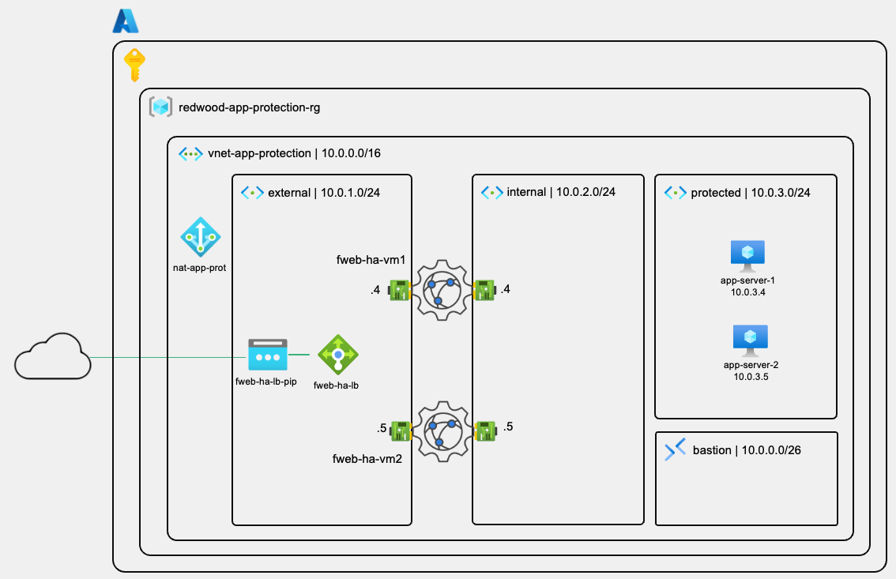

### Business Context

**Redwood Industries' Requirement:**

With the infrastructure and application servers in place, the security team needs FortiWeb actively intercepting and inspecting all traffic before it reaches the
application. At this stage there is no WAF policy applied yet — the goal is to establish a working traffic path through FortiWeb first, confirm the application is reachable, and
validate load distribution across both servers. WAF protection policies will be applied in Lab 4.

**The FortiWeb Traffic Model:**

FortiWeb operates as a **reverse proxy**. Clients connect to the Virtual Server IP — which is FortiWeb's own interface address — and FortiWeb establishes a separate
connection to the backend server on the client's behalf. This means:

- Clients never communicate directly with the application servers
- FortiWeb can inspect, modify, or block requests before they reach the backend
- The application servers only ever see FortiWeb's `port2` IP as the source of requests

---

## Understanding the FortiWeb Traffic Components

### The Three Building Blocks

FortiWeb uses three objects to define how traffic flows through the appliance:

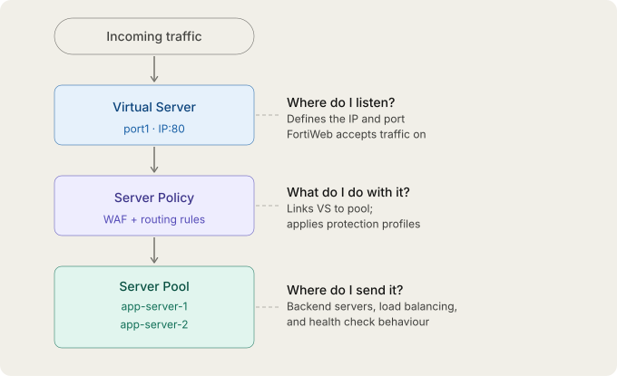

### Server Pool

The Server Pool defines the group of backend servers that FortiWeb forwards traffic to. Each server in the pool is a **Pool Member** with its own IP address, port, and weight.  
FortiWeb performs health checks against pool members and removes unhealthy members from rotation automatically.

### Virtual Server

The Virtual Server defines the IP address and port on which FortiWeb listens for incoming client connections. In this workshop, the Virtual Server uses FortiWeb's `port1` interface IP — the same IP that the Azure External Load Balancer sends traffic to. Clients connect to the load balancer's public IP, which forwards to FortiWeb's `port1` IP, which the Virtual Server intercepts.

### Server Policy

The Server Policy is the glue. It binds a Virtual Server to a Server Pool and defines the service type (HTTP or HTTPS). It is also where protection profiles are attached — which is how FortiWeb knows which WAF rules to apply to traffic matching this policy.

---

## Part A: Create the Server Pool

All configuration in this lab is performed on `fweb-ha-vm1` (the configuration Server). Changes will be replicated automatically to `fweb-ha-vm2`.

### Step 1: Create the Server Pool

#### 1.1 Navigate to Server Pool Configuration

1. Connect to `fweb-ha-vm1` at `https://<fweb-ha-nic-pip1>:8443`
2. Log in with your `fortiuser` credentials
3. Navigate to **Server Objects > Server > Server Pool**
4. Click **Create New**

#### 1.2 Configure the Server Pool

1. Configure the following settings:

   | Setting | Value |
   | --- | --- |
   | **Name** | `pool-redwood-app` |
   | **Protocol** | `HTTP` |
   | **Type** | `Reverse Proxy` |
   | **Single Server/Server Balance** | `Server Balance` |
   | **Server Health Check** | `HLTHCK_HTTP` |
   | **Load Balancing Algorithm** | `Round Robin` |

2. Click **OK** — the pool is created and you are returned to the pool list

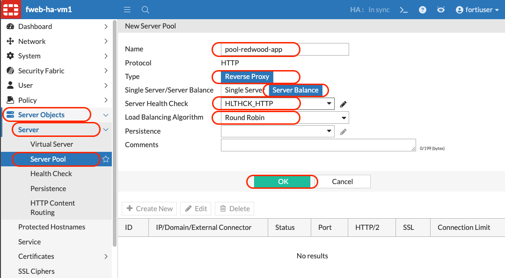

> [!NOTE]
> Selecting **Server Balance** enables the health check option to appear. **Round Robin** distributes requests evenly across pool members in sequence — each application server receives an equal share of traffic, which is ideal for this workshop.

### Step 2: Add Pool Members

#### 2.1 Open the Pool for Editing

1. In the **Server Pool** list, click on `pool-redwood-app` to open it
2. In the **Server Pool Member** section at the bottom, click **+ Create New**

#### 2.2 Add `app-server-1` as a Pool Member

1. Configure the following:

   | Setting | Value |
   | --- | --- |
   | **Status** | `Enable` |
   | **Server Type** | `IP` |
   | **IP** | `<app-server-1-private-ip>` (from your notes) |
   | **Port** | `80` |
   | **Connection Limit** | `0` (unlimited) |

   Leave all the other settings as default

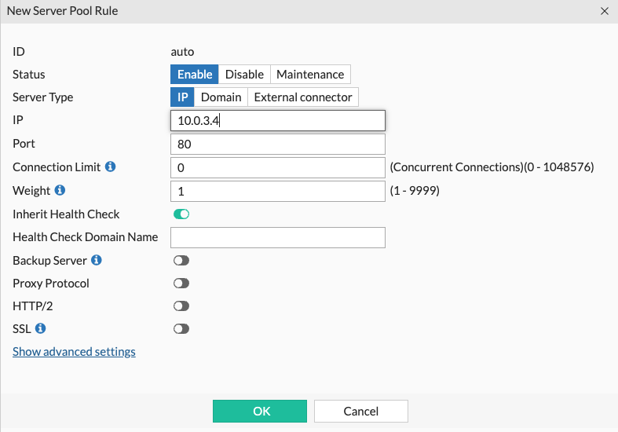

2. Click **OK**

#### 2.3 Add `app-server-2` as a Pool Member

1. Click **+ Create New** again in the **Server Pool Member** section
2. Configure the following:

   | Setting | Value |
   | --- | --- |
   | **Status** | `Enable` |
   | **Server Type** | `IP` |
   | **IP** | `<app-server-2-private-ip>` (from your notes) |
   | **Port** | `80` |
   | **Connection Limit** | `0` (unlimited) |

   Leave all the other settings as default

3. Click **OK**

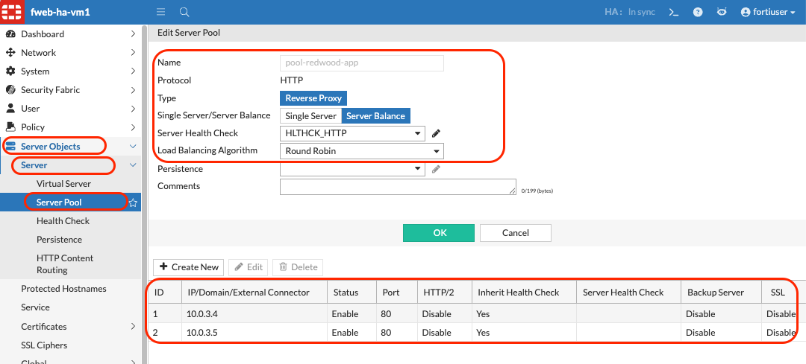

#### 2.4 Save the Server Pool

1. Click **OK** to save the pool with both members

### Validation

- [x] `pool-redwood-app` created with Round Robin load balancing
- [x] `app-server-1` added as pool member on port 80
- [x] `app-server-2` added as pool member on port 80
<!-- - [x] Both pool members showing healthy (green) status) -->

---

## Part B: Configure the Virtual Server

### Step 3: Create the Virtual Server

#### 3.1 Navigate to Virtual Server Configuration

1. Navigate to **Server Objects > Server > Virtual Server**
2. Click **+ Create New**

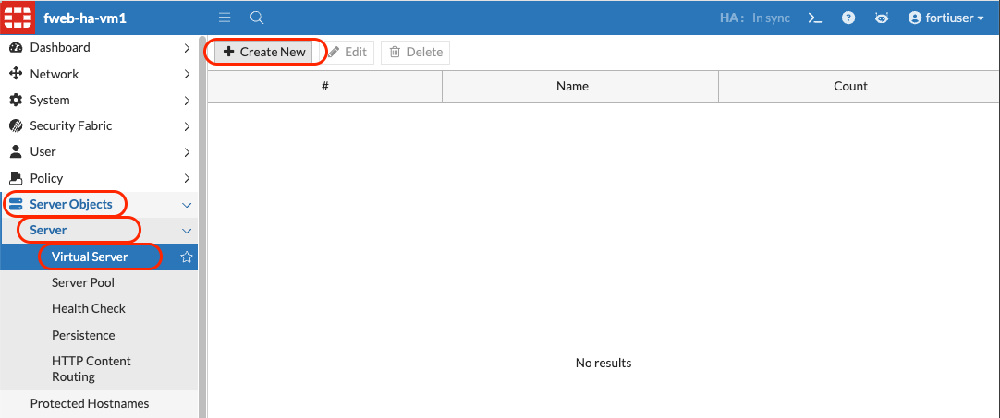

#### 3.2 Configure the Virtual Server

1. Configure the following:

   | Setting | Value |
   | --- | --- |
   | **Name** | `vs-redwood-app` |

2. Click **OK** — the Virtual Server is created

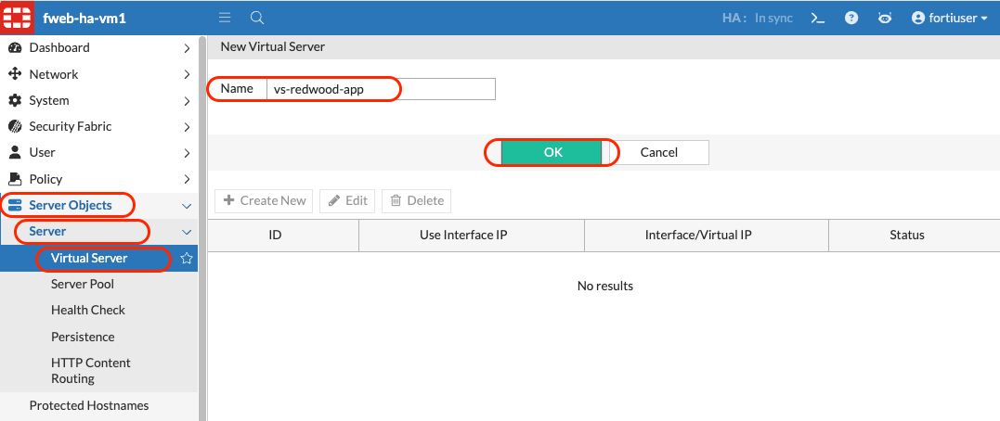

#### 3.3 Add a Virtual Server Item

The Virtual Server itself is a container. The **Virtual Server Item** defines the actual
IP address and port FortiWeb listens on.

1. In the **Virtual Server Item** section, click **+ Create New**
2. Configure the following:

   | Setting | Value |
   | --- | --- |
   | **Use Interface IP** | `Enable` ✅ |
   | **Interface** | `port1` |
   | **Status** | `Enable` |

   > Selecting **Use Interface IP** automatically binds the Virtual Server to the current IP address of `port1` — the interface connected to the `external` subnet. This is the IP address the Azure External Load Balancer forwards traffic to. You do not need to enter the IP manually.

   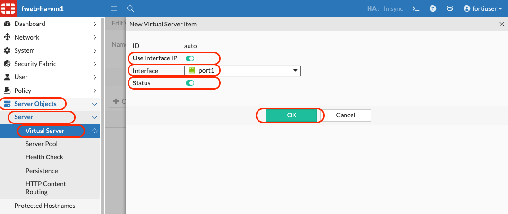

3. Click **OK**
4. Click **OK** to save the Virtual Server

#### 3.4 Verify the Virtual Server IP

1. Navigate back to **Server Objects > Server > Virtual Server**
2. Click on `vs-redwood-app`
3. In the **Virtual Server Item** section, confirm the IP address shown matches `fweb-ha-vm1`'s `port1` IP address

> [!TIP]
> To verify `port1`'s IP address, navigate to **Network > Interface** and note the IP assigned to `port1`. This should be an address in the `10.0.1.0/24` range.

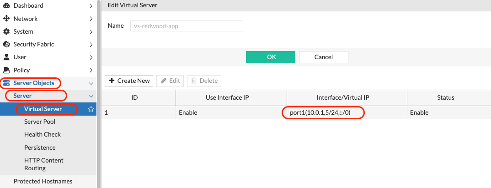

### Validation

- [x] `vs-redwood-app` Virtual Server created
- [x] Virtual Server Item configured using `port1` interface IP
- [x] Virtual Server Item status is **Enable**

---

## Part C: Create the Server Policy

### Step 4: Create the Server Policy

#### 4.1 Navigate to Server Policy Configuration

1. Navigate to **Policy > Server Policy**
2. Click **+ Create New**

#### 4.2 Configure the Server Policy

1. Configure the following:

   | Setting | Value |
   | --- | --- |
   | **Name** | `policy-redwood-app` |
   | **Deployment Mode** | `Single Server/Server Balance` |
   | **Virtual Server** | `vs-redwood-app` |
   | **Server Pool** | `pool-redwood-app` |
   | **HTTP Service** | `HTTP` (port 80) |
   | **Web Protection Profile** | `— None —` |

   > **Web Protection Profile** is intentionally left blank (`None`) at this stage. The policy will forward traffic to the application servers without any WAF inspection — this allows you to confirm the traffic path is working correctly before adding protection. The WAF profile will be attached in Lab 4.

2. Click **OK**

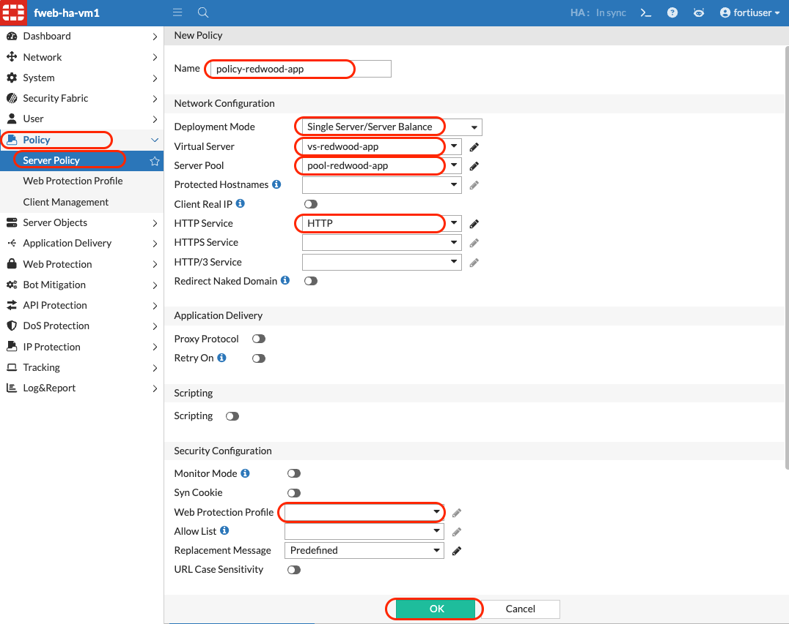

#### 4.3 Verify the Policy is Active

1. Navigate back to **Policy > Server Policy**
2. Confirm `policy-redwood-app` shows **Status: Running** (green link symbol)

### Validation

- [x] `policy-redwood-app` created
- [x] Virtual Server set to `vs-redwood-app`
- [x] Server Pool set to `pool-redwood-app`
- [x] Service set to `HTTP`
- [x] Web Protection Profile set to `None`
- [x] Policy status is **🔗 Running**

---

## Part D: Sync Configuration to Node 2

### Step 5: Verify Configuration Replication

All configuration objects created in this lab (Server Pool, Virtual Server, Server Policy) were created on `fweb-ha-vm1`. Verify they have been replicated to `fweb-ha-vm2` before proceeding to traffic testing.

#### 5.1 Check Replication Status on `fweb-ha-vm2`

1. Open a new browser tab and connect to `fweb-ha-vm2` at `https://<fweb-ha-nic-pip2>:8443`
2. Log in with your `fortiuser` credentials

#### 5.2 Verify Server Pool on Node 2

1. Navigate to **Server Objects > Server > Server Pool**
2. Confirm `pool-redwood-app` is present with both pool members

#### 5.3 Verify Virtual Server on Node 2

1. Navigate to **Server Objects > Server > Virtual Server**
2. Confirm `vs-redwood-app` is present

> [!NOTE]
> The Virtual Server Item on `fweb-ha-vm2` will show the **`port1` IP of `fweb-ha-vm2`** — not the IP of `fweb-ha-vm1`. This is correct behaviour. Each node applies the **Use Interface IP** setting to its own `port1` interface independently.

#### 5.4 Verify Server Policy on Node 2

1. Navigate to **Policy > Server Policy**
2. Confirm `policy-redwood-app` is present and **Running**

> [!NOTE]
> If any objects are missing on `fweb-ha-vm2` check the sync status. Allow up to 60 seconds for changes to propagate.

#### 5.3 Verify the application servers health on FortiWeb

1. Navigate to **Dashboard > Status > FortiView Topology**
2. Observe the status of each application server in the graph under the **Single Server/Server Pool** tab
3. Experiment by switching the view type

### Validation

- [x] `pool-redwood-app` present on `fweb-ha-vm2` with both members
- [x] `vs-redwood-app` present on `fweb-ha-vm2`
- [x] `policy-redwood-app` present and enabled on `fweb-ha-vm2`
- [x] Both application servers appears as healthy in the **FortiView Topology**

---

## Part E: Test End-to-End Traffic Flow

### Step 6: Access the Application Through FortiWeb

#### 6.1 Locate the Load Balancer Public IP

1. In the Azure Portal, navigate to `redwood-app-protection-rg`
2. Click on `fweb-ha-lb`
3. In **Overview**, note the **Frontend IP address** (the public IP associated with `fweb-ha-lb-pip`)

> [!TIP]
> This is the same IP you recorded in your text editor in Lab 1 as `fweb-ha-lb-pip`.

#### 6.2 Access the Application

1. Open a new browser tab
2. Navigate to: `http://<fweb-ha-loadbalance-IP>`
3. You should see the Redwood Industries demo application — a coloured gradient page with a server name and **Service Online** badge

> [!NOTE]
> If the page does not load immediately, wait 30 seconds and refresh. The Azure Load Balancer health probes need to confirm both FortiWeb nodes are healthy before forwarding traffic.

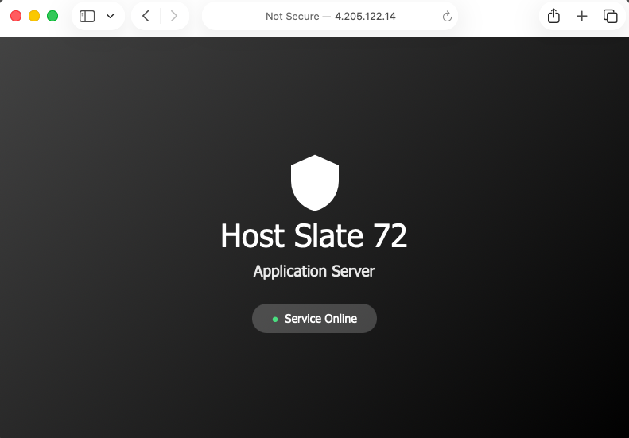

#### 6.3 Confirm Load Balancing Across Both Application Servers

The demo application displays the **hostname of the server that served the request**. By refreshing the page after waiting about 2 minutes, you should see the server name alternate between `app-server-1` and `app-server-2` — confirming that FortiWeb's Round Robin pool is distributing traffic across both backends.

> [!NOTE]
> The Azure External Load Balancer uses a 5-tuple hash for session persistence, which means consecutive requests from the same browser may land on the same FortiWeb node. To observe the Round Robin distribution across both **application servers**, try accessing the URL from different browsers, devices, or using an incognito window.

1. Refresh the browser page
2. Observe the server name changing between requests

#### 6.4 Verify FortiWeb is in the Traffic Path

Confirm that FortiWeb is actively proxying requests — not just passing traffic through.

1. Enable traffic log on FortiWeb

   ```bash
   config log traffic-log
     set status enable
     set packet-log enable
   end
   ```

2. Enable traffic log per server policy

   ```bash
   config server-policy policy
     edit "policy-redwood-app"
       set tlog enable
     next
   end
   ```

3. On `fweb-ha-vm1`, navigate to **Log&Report > Log Access > Traffic**
4. You should see entries for the requests you just made. It not, try the `fweb-ha-vm2` FortiWeb logs all proxied traffic now

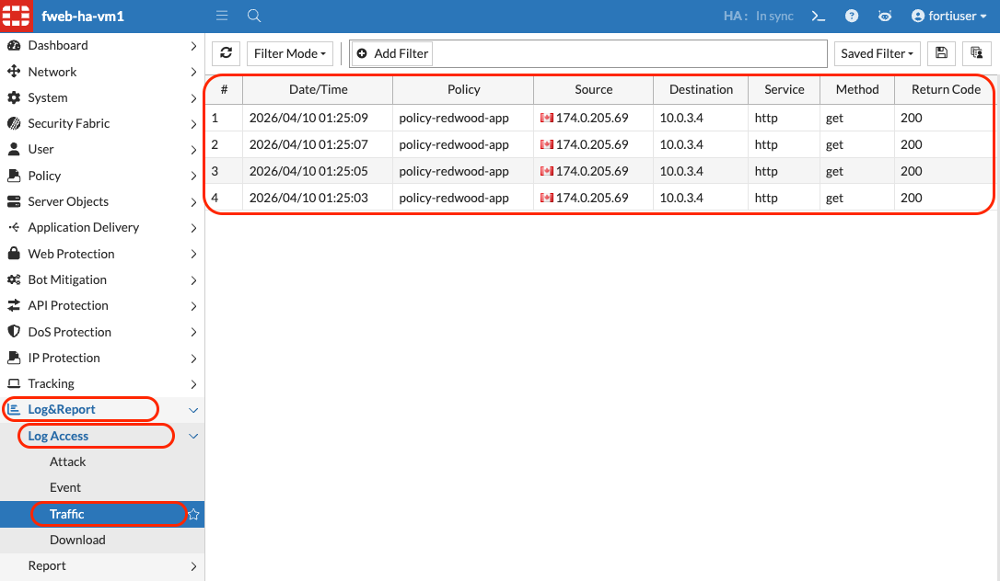

#### 6.5 Test Attack Detection (Application Only — No WAF Yet)

The demo application has **client-side** attack detection. FortiWeb has no WAF profile
attached yet — so at this point, attacks reach the application server unblocked.

1. In your browser, navigate to:

   ```http
   http://<fweb-ha-loadbalance-IP>/?name=' OR 'x'='x
   ```

2. The page should switch to the **attack state** — dark red background, flickering
   animation, and the attack details displayed

   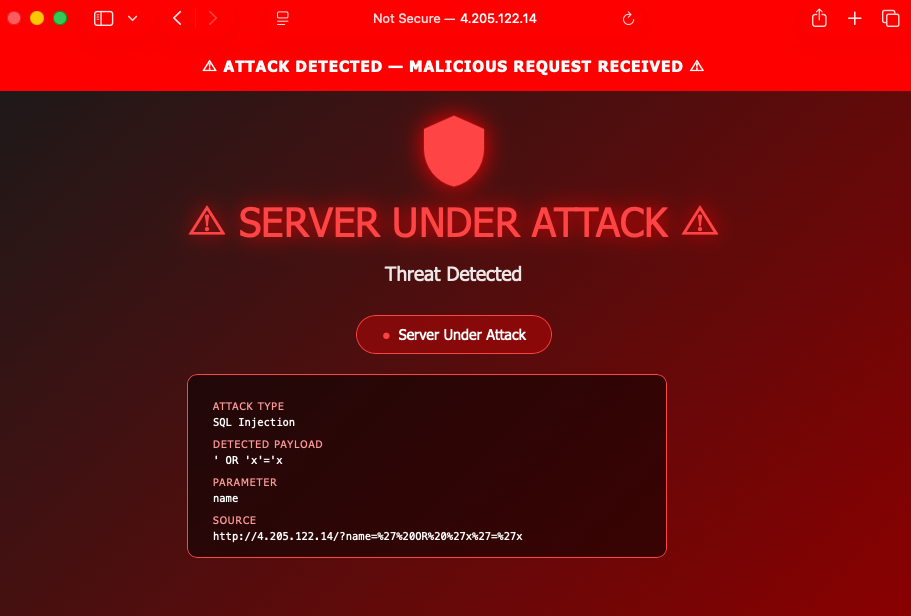

> [!NOTE]
> The application is detecting the payload in the URL and changing its appearance. The request **did reach the application server** — FortiWeb forwarded it without blocking because no protection profile is attached to the policy yet. This is the **unprotected** baseline you will compare against in Lab 4.

### Validation

- [x] Application accessible at `http://<fweb-ha-loadbalance-IP>`
- [x] Demo application page rendered correctly (coloured background, server name visible)
- [x] Server name changes across multiple requests confirming load balancing
- [x] SQL injection payload reaches the application unblocked (expected at this stage)
- [x] FortiWeb logs show traffic entries for the test requests

---

## Lab 3 Complete! 🎉

### What You've Accomplished

✅ **Server Pool Created:**

- `pool-redwood-app` with Round Robin load balancing
- Both `app-server-1` and `app-server-2` as healthy pool members on port 80

✅ **Virtual Server Configured:**

- `vs-redwood-app` bound to `port1` interface IP on both nodes
- Listening for incoming HTTP traffic from the Azure External Load Balancer

✅ **Server Policy Active:**

- `policy-redwood-app` connecting Virtual Server to Server Pool
- HTTP service — no WAF protection profile (intentional at this stage)

✅ **Configuration Replicated:**

- All objects confirmed present and active on `fweb-ha-vm2`

✅ **End-to-End Traffic Verified:**

- Application accessible through the load balancer public IP
- Round Robin load balancing confirmed across both application servers
- FortiWeb confirmed in the traffic path via logs
- Unprotected attack baseline established for Lab 4 comparison

### Key Takeaways

1. **FortiWeb operates as a reverse proxy:** Clients connect to FortiWeb — never directly to the application servers. FortiWeb establishes its own connection to the backend on the client's behalf, giving it complete visibility and control over the traffic.

2. **The three-object model is sequential:** Virtual Server defines where to listen → Server Policy defines what to do → Server Pool defines where to send. Each object has one responsibility. This separation makes configuration changes surgical and predictable.

3. **No protection profile means no WAF inspection:** A Server Policy without a protection profile is a transparent proxy — it forwards traffic without any security analysis. This is useful for establishing a baseline, but not for production.

4. **Configuration replication must be verified after every change:** Each time you modify FortiWeb on Node 1, confirm Node 2 has received the update before testing traffic. Both nodes serve live traffic — inconsistent configuration produces inconsistent results.

5. **Health checks protect your users:** FortiWeb's Server Pool health checks continuously verify that application servers are responding. If `app-server-1` fails, FortiWeb automatically stops sending traffic to it — without any manual intervention.

### Validation Checklist

Before proceeding to Lab 4, verify:

**FortiWeb Configuration (both nodes):**

- [x] `pool-redwood-app` present with two healthy members on port 80
- [x] `vs-redwood-app` present and bound to `port1`
- [x] `policy-redwood-app` present, enabled, no protection profile

**Traffic:**

- [x] Application accessible at `http://<fweb-ha-loadbalance-IP>`
- [x] Load balancing confirmed across both application servers
- [x] Attack payloads reach the application unblocked (expected — no WAF yet)

### Next Steps

Ready for **Lab 4: WAF Protection and Attack Simulation!**

In Lab 4, you will:

- Explore the built-in FortiWeb protection profiles
- Attach the **Inline Standard Protection** profile to `policy-redwood-app`
- Replay the same SQL injection and XSS attacks from this lab
- Observe FortiWeb blocking the attacks before they reach the application
- Review the attack logs and understand what FortiWeb detected and why
- Test additional attack types from the OWASP Top 10

---

## Troubleshooting Reference

### Issue: Application Not Loading at Load Balancer IP

1. Verify the Server Policy `policy-redwood-app` is properly configured on both nodes
2. Verify the Virtual Server `vs-redwood-app` is **Enabled**
3. Verify both pool members in `pool-redwood-app` show a healthy (green) status
4. Navigate to **Log&Report > Log Access > Traffic** on `fweb-ha-vm1` — if requests are arriving at FortiWeb but failing, you will see error entries here
5. Check the Azure Load Balancer health probes — navigate to `fweb-ha-loadbalance > Monitoring > Insights` to confirm both backend nodes has a Health status: Warning with an Average Health Probe status of 50%.

### Issue: Pool Members Showing Unhealthy

1. Verify nginx is running on both application servers: 
   - Connect via Bastion and run `systemctl status nginx`
2. Verify the static route `10.0.0.0/16` via `port2` is present on `fweb-ha-vm1` (navigate to **Network > Route**)
3. Verify the private IPs in the pool match the actual IPs of the application servers (check in the Azure Portal under each VM's **Overview**)
4. Try a manual ping from the FortiWeb CLI console: `execute ping <app-server-private-ip>`

### Issue: Always Seeing the Same Application Server

The Round Robin pool distributes connections — not individual HTTP requests. If your
browser keeps an open HTTP/1.1 connection alive (keep-alive), all requests on that
connection go to the same server. To see both servers:

- Use an incognito window for each test
- Try accessing from a different device or browser
- Close and reopen the browser between tests

### Issue: Attack Payload Is Being Blocked Already

If the SQL injection test in Step 6.5 is being blocked before reaching the application,
a protection profile may have been accidentally attached to the policy.

1. Navigate to **Policy > Server Policy > policy-redwood-app**
2. Verify **Web Protection Profile** is set to `— None —`
3. If a profile is attached, click **Edit**, remove it, and click **OK**

---

*Lab Guide Version 1.0 — April 2026*

*Next: [Lab 4 — WAF Protection and Attack Simulation](/az-301-lab4/README.md)*
